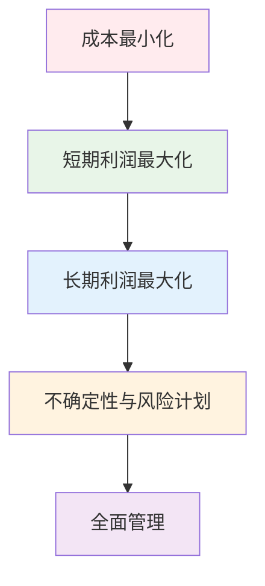

## 考试信息
- **科目代码**: 11748
- **学分**: 6
- **考试日期**: 2025年10月26日
- **考试时间**: 9:00-11:30 (上午)
- **考点**: 海珠区
- **状态**: 已缴费

## 课程简介

商务运营管理是工商管理专业的核心课程之一，主要研究企业运营过程中的计划、组织、协调和控制等管理活动。通过学习本课程，学生将掌握现代企业运营管理的基本理论、方法和技能。

## 主要学习内容

### 第一章 运营管理引论

#### 1.1 运营管理的含义

##### 1.1.1 制造业运营

**运营的定义**：
运营可以定义为一个公司将一系列的输入转化为组织顾客所需要的产品和服务的过程。【选择、名词解释】

**运营管理的定义**：
运营管理是指涉及任何商业组织中输入-输出循环的有效管理，包括制造业的运营管理和服务业的运营管理。

##### 1.1.2 输入-输出循环

**输入-输出循环的概念**：
输入-输出循环是将包括土地、劳动力、资金和企业家在内的输入转化为商品或服务输出的方式（商品或服务也可以作为其他过程的输入）。

**生产要素（输入）**：
为了生产所需数量的产品和服务来满足人们的需求，有四种重要的资源是必须的：

- **土地**：所有的自然资源，以及地下的矿藏、水和海中的鱼
- **劳动力**：劳动者的体力和脑力技能
- **资金**：企业拥有的可以更方便更有效的生产的一切，包括建筑物、机器等
- **企业家**：只能够组织其他生产要素启动生产过程的人

**制造业运营的输入输出循环**：

*输入要素*：
- 物料
- 人员
- 设备
- 建筑物
- 资金：维护日常运作的资金和收支活动【选择】
- 知识
- 信息

*输出要素*：
- 产品
- 相关服务

##### 1.1.3 资金流

**资金的定义**：
资金指企业所拥有的、用于更方便和更有效地制造产品的一切资源。资金也是输入-输出循环中的一项重要输入。

**资金的类型**：
1. **现金和营运资金**：用于维持日常运作的资金
2. **长期资金**：用于购买厂房和设备、支付战略发展（如研究新生产过程等）的资金
   - 也可以把资金视为其他资源的反向资源流

**运营早期阶段必须关注的方面**：

1. **价值创造与盈利性**：
   - 运营必须增加价值并且也必须能盈利
   - 利润 = 收入 - 成本

2. **现金流管理**：
   - 关注现金流的技术性
   - 在得到顾客收入之前需要实实在在的投入
   - 短期内收入与支出在时间上可能不匹配

3. **物流管理**：
   - 密切关注物流，设计运营系统，可以减少此类问题
   - 如大规模零售企业可以立即得到顾客收入，而不像制造业需要等待数月

4. **运营管理**：
   - 精心管理企业的运营，可使企业先于支出而获得足够的收入
   - 比如订单式生产加工

**知识和信息输入**：
知识和信息也是一项重要输入，包括：

- 顾客的需求
- 过程的技术能力和未来可用的过程
- 工作安全性有关的法律、过程对环境的影响
- 资源的可用性
- 经济、社会和政治环境的趋势

**制造业运营的关键考虑因素**：
从输入输出的角度考虑，制造业运营需要考虑以下几个关键点：

1. **运营是组织的中心**：运营是组织活动的核心
2. **全员参与**：运营在一定程度上与所有的员工有关，并且是许多员工集中完成的主要工作
3. **多学科依赖**：运营依赖多个学科（工程学、财政学、信息技术、人事管理等）
4. **精细管理**：运营要想盈利，需要精细地管理

**转化过程**：
- **定义**：将输入变为输出的过程
- **所需资源**：转化过程需要设备和建筑物
- **设备内容**：设备包含信息技术及所有需要支持运营的其他设备

**生产运营/制造运营**：
生产运营/制造运营是将物料转化为顾客需要的产品的过程。

##### 1.1.4 运营实例

**前台与后台的输入和输出**：
输入-后台-前台-顾客。前台与顾客直接接触，后台与顾客不直接接触而为服务增添价值。例如：顾客去饭店吃饭，厨师不与顾客直接接触而是为顾客提供美味的菜肴（服务）。顾客必须参与。

**研究各种运营事务组织的特定的关键领域【简答题】**：
1. 顾客特征及需要
2. 组织如何解释顾客需要，并能使顾客满意
3. 过程的规模、过程是例行的还是特殊的
4. 产品或服务是如何提供的，其提供过程是如何设计、计划和控制的
5. 如何管理商品质量和提供服务的内容
6. 技术的角色

### 1.2 运营经理的角色

#### 1.2.1 运营经理的职责

**运营经理的定义**：
运营经理是为了确保组织有效运营，负责过程设计、工作计划与实施的人。

**运营经理的职责【简答题，注意顺序不能错】**：
1. **过程设计**：就是建立最有利于生产过程的系统
2. **工作计划**：建立从计划到详细工作排程各项工作程序
3. **实施**：确保计划和意图得到实际地执行

#### 1.2.2 制造过程的选择

**制造过程选择的定义**：
制造过程选择是公司必须做出的关于所用生产方法的决策。

**生产方式的类型**：
- 大规模生产方式
- 批量生产方式
- 加工车间或包工生产

**制造过程选择坐标图**：

*图1.2 制造过程选择坐标图*

**坐标图说明**：
- **横轴（规模）**：表示生产规模，即在给定的时期内所生产的类似品目数量的近似平均值
- **纵轴（多样性）**：表示产品的多样性，或者说是产品的范围

**三种生产方式在坐标图中的位置**：
1. **加工车间生产**：位于左上角，具有高多样性和小规模特征
2. **批量生产**：位于中上位置，具有中等多样性和中等规模特征
3. **生产线或大规模生产**：位于右下角，具有低多样性和大规模特征

**制造过程进行分类的潜在价值**：
- 由于产品会不断趋向多样化，相应地控制系统需要改变
- 考虑制造工厂的相似性，解释某些特定的因素

#### 1.2.3 服务业的过程选择

**服务类型**：
- **大规模服务**（超市）
- **单店式服务**（餐馆）
- **专业化服务**（理发）

**各类型特点**：
- **大规模服务**：提供标准化产品、价值增值在"后台"实现，并且是以产品为关注焦点
- **单店式服务**：平衡大量顾客与适应单个顾客需求之间的关系
- **专业化服务**：劳动密集型，大量的"前台"时间用于服务顾客

**高劳动密集情况下的运营管理的运营经理【简答题】**：
1. 人员招聘、培训和福利
2. 制定标准化的工作程序，以促进高质量和低成本地工作
3. 在顾客多样化的需求范围内为工作人员排程
4. 控制不同工作地点的员工
5. 管理组织今后的发展

**以机器设备为基础的服务提供情境的运营经理【简答题】**：
1. 有效的投资，特别是在技术飞速变化的领域
2. 使服务提供能力的固定投资与多变的顾客需求相匹配
3. 控制服务提供过程，包括设备和顾客的安全

**高度定制化情境下的运营管理【简答题】**：
1. 保持质量
2. 管理有自主权的服务提供者。经过专业化培训的员工比雇佣他们的组织能够识别出顾客更多的需要

**低定制化情境下的运营管理【简答题】**：
1. 确定标准化的服务。这个服务可能是由机器提供的，应该对顾客有吸引力并且适合物理环境
2. 以低成本保持质量

#### 1.2.4 办公过程选择

*（此部分内容待补充）*

### 1.3 运营选择与盈利性

#### 1.3.1 成本与收入

**收入的定义**：
收入是企业为其商品和服务收取的货币量。

**总收入**：
总收入是每件卖出商品的价格乘以卖出的数量，即销售的总价值。
- **公式**：总收入 = 价格 × 销量

**成本的定义**：
成本是指制造商品或提供服务所支出的货币数量。

**总成本的构成**：
公司经营的总成本分为两部分：固定成本和可变成本。
- **公式**：总成本 = 固定成本 + 可变成本

**固定成本**：
固定成本是那些不论生产了多少数量的产品都不变的成本。固定成本是恒定的，包括：
- 租金
- 税金
- 保险

**可变成本**：
可变成本是那些随着产量的多少而变化的成本。当没有生产产品时，可变成本是零，但是随着产量的增加可变成本也逐渐增加。可变成本包括：
- 工资
- 购买原材料的费用
- 电力成本

**利润的定义**：
利润就是销售产品和服务所得到的收入与提供这些产品和服务的成本的差值。
- **公式**：总利润 = 总收入 - 总成本

**单位利润的重要性**：
总收入只是公司保证利润最大化需要的一部分信息。了解单位利润，以及是利用更大的产量还是较少的产量来增加总利润，会十分有用。

如果一个公司生产多种不同的产品，或者开始销售一件新产品，单位利润就特别重要。

**单位利润的计算**：
为了计算单位利润，必须知道单位成本和单位收入。

- **平均成本** = 总成本 ÷ 产量
- **平均收入** = 总收入 ÷ 产量
- **单位利润** = 平均收入 - 平均成本

#### 1.3.2 盈亏平衡分析

**盈亏平衡分析的定义**：
盈亏平衡分析是研究在可能的产量水平下成本与收入之间关系的一种方法。以便确定刚好能够弥补成本的销量和输出水平。

**盈亏平衡分析的假设条件**：
1. 在所关注时期的开始或结束时没有物料库存
2. 所有的物料费用都已付款，并且所有的收入都从顾客那里收取
3. 可变成本与关注时期内指定生产数量的工作有关

**盈亏平衡图**：
盈亏平衡图是描绘盈亏平衡分析的一种可视化方式。

*图1.1 盈亏平衡分析图*

**盈亏平衡图的构成**：
- 横轴表示产量的水平
- 纵轴表示成本和收入
- 成本和收入是对应产量的水平描绘出来的

**盈亏平衡图的要素**：
- **固定成本**：是一条水平线，即在产量水平为零时和在较高时的固定成本是一样的
- **可变成本**：始于产量为零和固定成本曲线的起始端
- **盈亏平衡点**：成本等于收入，即没有利润或亏损

**盈亏平衡图的分析**：
- 在总成本曲线比总收入曲线高时，公司将会发生亏损
- 在总收入曲线比总成本曲线高时，公司正在获取利润

**盈亏平衡图的特征**：
1. 在一定时期内执行的工作总量是有限的（产能）
2. 固定成本与产量无关（根据定义）
3. 随着产量增加，可变成本上升
4. 利润定义为收入减去成本。在图中没有使用一条单独的直线来表示。利润额可以从收入曲线和总成本线的差值看到
5. 盈亏平衡点出现在收入等于总成本时的产量水平。从盈亏平衡点向左企业亏损，向右则企业盈利

## 第二章 质量管理

### 2.1 质量与顾客

**顾客的需要【选择、简答题】**：
1. **产品属性**：从产品本身能找到哪些特色
2. **产品性能**：产品如何很好地实现其功能
3. **服务特性**：卖方提供给顾客的帮助数量
4. **保修**：保证的时间期限和范围
5. **交付期限**：产品多久能够交付给顾客
6. **总价格**：包括折扣、担保等其他的一切在内的产品的总价格。具有竞争力，或许有在一定时期内可以按低税率甚至是零税率来支付的条款
7. **随产品提供的其他东西**

**符合性的质量观【名词解释】**：
**质量**可以被视为顾客的要求实际得到满足的程度，它关注的是实际性能与许诺（承诺）的性能的关系。

**符合性的质量观**质量是通过产品服务与明示的要求符合的程度来衡量的。

### 2.2 产品质量

**运营促进高质量产品的方式**：
运营可以通过两种更直接的方式促进提供高质量的产品：
1. 基于运营和其他管理职能的传统关系
2. 将运营活动作为一项单独的活动

#### 2.2.1 传统的追求质量的方法（低频且易）【020201】

**传统观点**：
关于运营与其他管理职能的关系的传统观点支持职能分离。将产品转化与其他组织活动相分开，但是质量控制不应该独立于其他运营活动。所有的相关产品决策影响符合性质量。

**产品规格符合顾客需要的具体表现**：
1. **产品特性和性能**：假定包括在产品规格之中并且质量控制处于正常状态
2. **服务特性**：作为运营过程的一部分
3. **保修**：假定备用部件和维修与更换设施持续可用。这是生产、库存计划与控制关注的主要内容
4. **交付期限**：利用生产计划系统来解决
5. **合适的价格**：这需要控制成本和提高生产率

**传统与现代观点的对比**：
传统的思想以生产率和质量之间的权衡为中心。现代观点认为维持高质量与大规模生产和低成本生产是完全一致的。无论哪种观点占主导，关键点很明显：制定生产决策必须考虑一系列事项，质量决策与制定全面的运营决策是不能分开的。

#### 2.2.2 追求质量的现代方法（低频且易）【020202】

现代方法将运营活动作为一项单独的活动。这种组织方式认为组织的决策应该被视为一个整体，并以满足特定顾客群的需要为关注焦点。

#### 2.2.3 供应链（低频且易）【020103】

**供应链的定义**：
供应链是指从产品生产到产品提供的一系列过程联系在一起而形成一条供应链。

**内部顾客的定义**：
内部顾客是指任何一个人从其他人（或过程）接收商品、服务或者信息的个体（或过程）。

#### 2.2.4 全面质量管理（高频且难）【020104】

**全面质量管理的定义**：
全面质量管理是以单个过程及其与供应链上其他部分之间关系为基础的，它强调在供应链上的每一个环节达成一致认同的绩效、适时的供应能力、低成本以及监视变化的需要。每一个过程既是供应链中下一个过程的供应商，又是上一个过程的顾客。

**全面质量管理的哲学**：
全面质量管理方法的深层哲学之一是通过主动的管理参与，在产品或服务过程的每个阶段进行仔细地计划和控制。

#### 2.2.5 产出率管理（高频且难）【020105】

**产出率的两种情况**：
1. 企业确保交付的产品没有任何缺陷
2. 如果发生缺陷，则顾客退货，企业纠正和回收，则产生各种不增加价值的活动

**产出率管理的定义**：
产出率管理即企业确保最大比例的将无缺陷的商品提供给顾客的过程。因此，企业会尽其所能追求高产出率。

**达到零缺陷情境的技术**：
达到零缺陷情境（或100%的产出率）是有可能的，需要用到以下两种技术：

1. **首次正确性生产**：制造过程能够很好得到控制以至于产出率中不包含任何缺陷的产品
2. **高效挑选系统**：制造过程包括一个挑选程序来组成一个不完美产出率系统，这样可以除去有缺陷的产品。这就需要在生产过程中有一个高效的挑选系统

#### 2.2.6 检验、选别与验收抽样（低频且易）【020106】

**验收抽样的定义**：
验收抽样指检验制造产品的样本以判定产品总体的质量水平。

**验收抽样的风险**：
验收抽样可能导致做出错误的决策：可能一个不良的产品批次交付给顾客，或者一个质量好的产品批次被拒绝。

**使用验收抽样的假设**：
1. 产品集中为（大）批次
2. 检验程序可信
3. 抽样无偏，并且系统处理所有偶然事件（比如：纠正拒收产品批次和抚慰不满意的顾客）

#### 2.2.7 统计过程控制（低频且难）【020107】

**统计过程控制的定义**：
统计过程控制基于对所有工作过程的输出进行抽样的思想，不仅检出缺陷，而且关注过程输出的趋势。即指明那些虽然现在可以接受，但是将来会发生的问题。这样就可以在问题出现之前采取措施而避免麻烦。即预防比治疗好得多。

**统计过程控制的应用**：
成熟的统计过程控制系统能够使它的使用者控制他们面临的风险。这种技术的应用比产品控制广泛的多。它可以用于服务和信息处理情境的许多方面，过程操作人员常常使用。它与各种诊断技术结合在一起，形成了一个工具包，用于控制当前的运营并指出改善未来事项的方法。

#### 2.2.8 监视质量成本（低频且难）【020108】

**质量成本的重要性**：
质量成本是制定决策必不可少的基础。

**质量成本的分类**：

1. **显见成本**（大部分可以相当容易地测量）：
   - 报废和返工的内部成本
   - 外部保证成本和缺陷商品更换成本
   - 检测、测试程序的成本和所有管理成本

2. **系统成本**（更积极的测量方法）：
   - 产能损失
   - 因返工延误而导致交货期延长
   - 为赶超进度而产生的加班工资
   - 应对产出率的变动而产生的额外库存成本

3. **外部成本**（在工厂外部）：
   - 由于不良的质量名声而造成的商誉和销量损失
   - 如果组织决定采取措施改善质量以弥补这些成本，将还会在培训、建立质量管理体系上产生成本

#### 2.2.9 标杆超越（低频且易）【020109】

**标杆超越的定义**：
标杆超越，或者确定最小的可接受的标准。它需要广泛的市场研究和仔细地调查对手所提供的产品。

**标杆超越的重要性**：
一个公司提供的质量越好，相对于竞争对手就越有竞争力。因此，公司需要获得其竞争对手所提供产品和服务质量方面的信息。

#### 2.2.10 质量管理标准（低频且易）【020110】

**质量管理标准的建立**：
英国的主要行业和零售组织为他们的供应商规定了商品质量和质量控制系统的标准，这导致了国家标准的建立。这个标准为组织提供了一个寻求其质量管理体系获得外部承认的机会。

**质量管理标准的内容**：
从运营的观点看，国家奖项提供了一个关于质量计划和质量控制体系组成部分的检查清单。这个英国的体系现在已成为欧洲标准，其中包括管理责任、合同以及设计控制、采购和加工过程。

### 2.3 服务质量

#### 2.3.1 服务质量的决定因素（低频且易）【020301】

**SERVQUAL模型**：
服务质量模型简称为SERVQUAL模型，服务质量的决定因素如下：

1. **可靠性**：服务提供者必须每次都提供恰当的服务
2. **响应性**：服务提供者必须提供敏捷的、心甘情愿的服务
3. **胜任力**：服务提供者必须拥有相称的技能和知识
4. **可访问**：联系非常方便
5. **礼貌**：服务提供者应该恭敬有礼
6. **沟通**：谈话内容容易理解
7. **可信性**：服务提供者和他的组织应该被顾客认为是可靠的、可信任的
8. **安全**：服务体验必须免于危险并且是完全可信
9. **理解**：服务提供者认真了解顾客特别需求
10. **有形性**：设施、物料应该尽可能有吸引力

#### 2.3.2 差距分析（低频且难）【020302】

**服务质量法则**：
人们引用最多的服务质量法则之一认为：**满意 = 感知 - 期望**

**差距分析的定义**：
我们对所得到服务的满意度就是我们认为实际得到的与我们认为将会得到的之间的差。即可以理解为差距分析。

**差距分析的重要性**：
这使我们关注在服务之前、之中、之后的沟通的重要性。期望会随时间改变。

**差距分析的过程**：
差距分析即确定我们期望接受的服务与实际接受的服务之间存在差距的原因的过程。识别服务过程中的差距，然后补救这些差距。

#### 2.3.3 公共部门服务背景（低频且难）【020303】

**公共部门服务的特点**：
用于公共服务的许多设施是免费的。尽管如此，也有许多类似的商业服务交付。顾客保有期望和价值，并且认为他们拥有传统的权利，甚至会超过典型的商业服务接触。另外，直到最近几年公共部门才开始接受它的服务角色。

## 第三章 计划与控制
### 3.1 控制的实质

#### 3.1.1 控制的含义（低频且易）【030101】

**控制的定义**：
控制是指付出极大努力报告变异，并且假定管理人员收到报告后会采取措施。控制涉及建立与措施相关联的适用的信息系统。控制系统是由控制主体、控制客体和控制媒体组成的具有自身目标和功能的管理系统。

#### 3.1.2 控制环（低频且难）【030102】

**控制环的定义**：
控制环是指一旦确定了不得不控制过程时，就应该检查过程的输出以及与输出有关的数据，并与确立的标准进行比较。人们比较关于实际情况的统计数据和标准所期望的结果，然后，利用这些比较的结果，提出实际绩效与标准匹配的方法。

*图3.1 控制环流程图*

#### 3.1.3 控制的过程（低频且易）【030103】

**控制过程的七个要素**：
过程是需要实施控制的系统的一部分：

1. **输出**：过程的结果并可作为控制的基础
2. **测量**：按一定的时间间隔收集输出的数据
3. **统计数据**：从所收集的输出数据中获得的信息，为了与既定标准进行比较，有可能利用几个不同时期的数据
4. **标准**：期望的输出结果
5. **比较**：考虑表明实际绩效的统计数据与表明期望绩效的标准之间的差异。比较可以作为采取措施的基础
6. **决策制定者**：分析比较结果，并结合其他所有的相关信息，管理输入以实现达成一致标准规定绩效的个人或团体
7. **输入**：过程需要的各种类型的实物、资金、数据输入，输入的特征决定过程实际绩效

**控制包括的四个过程**：
1. 基本的输入——输出转换过程
2. 基本过程输出的测量过程
3. 报告过程
4. 采取措施的过程

这些不同的过程都是控制的组成部分，每一个过程都必须受控。
#### 3.1.4 制造控制系统（低频且易）【030104】

**制造控制系统的特征**：
以制造业为例，概括控制系统的特征，如下：

1. **过程**：一个物料转化过程
2. **输出**：按规定规格制造的塑料箱子
3. **测量**：包括箱子实物大小、产成品种类、箱子整体外观、废品数量等
4. **统计数据和标准**：应该包括顾客对箱子的实际需求和过程能力
5. **比较**：统计数据和标准之间的差异应该报告给决策制定者
6. **决策制定者**：决策制定者可能是一位设备操作员、现场主管或者一位工程师、一位主管。决策制定者根据所提供的信息采取措施。有些决策是自动生成的

#### 3.1.5 服务控制系统（低频且易）【030105】

**服务控制系统的特点**：
服务控制系统通常是通过提高提供服务的质量或服务提供的水平来实现。

**使用控制系统来评估的特征**：
过程、输出、测量和统计数据、标准、决策制定者和输入。

#### 3.1.6 改进质量的策略（低频且易）【030106】

**改进质量策略的定义**：
改进质量的策略指人们做了大量的努力，并运用一系列标准化的运营计划和系统分析技术来改进运营过程的措施。

**业务流程再造（BPR）**：
业务流程再造（BPR）的发展能够支持快速变革的实施。该系统是在20世纪90年代早期发明的。它运用了一系列标准化的运营计划和系统分析技术。

BPR满足了为分析运营过程提供方法论、为实施变革提供方法的核心需要。

#### 3.1.7 改进制造过程（低频且易）【030107】

**制造过程改进的重要性**：
在产品制造的背景下，获得改进是可行的。有效的改进，可以降低成本，提高生产率或者改善成品，使其更具市场力。而潜在的改进是使产品满足质量标准的能力更加稳定。

改进是战略计划的一部分，它影响着整个运营，并且确保资源可用以完成计划。

**制造过程的改进领域**：
1. 检测程序
2. 物料及其移动
3. 搬运
4. 包装

#### 3.1.8 提高服务水平（低频且易）【030108】

*图3.1 服务质量要素图*

**服务质量的决定因素**：
服务质量取决于以下因素的综合：

1. **人际交往技能**
2. **知识**
3. **系统**

**各要素的重要性**：
人际交往技能和知识是培训和经验的结果。个人服务提供者可能有他们自己的风格，这可能受顾客的欢迎也可能不受欢迎。这就表明服务提供者的性格和态度是十分重要的。在招聘时应该牢记这一点。

适宜的系统取决于它们的设计以及所提供的系统运营资源。要使设计的系统合理有效，这三个要素都是必须的。通过综合考虑每个方面的经验，就可以进行质量改进和质量控制。

#### 3.1.9 办公业务（低频且易）【030109】

**办公业务的特点**：
办公是数据和信息处理过程。在现代的办公系统中，人们关注信息系统的设计和整个系统中的人机接口部分。

在一定程度上，办公类似于工厂中的批量生产。

现在许多办公工作是常规性的，但在其他情境中，也要求非标准化的解决方案。个人和网络化计算机系统帮助服务提供者来适应日益变化的服务需要。

### 3.2 控制技术

#### 3.2.1 设定目标（低频且难）【030201】

**设定目标的重要性**：
任何正式的改进工作必须始于确定职责范围和目标。其进展取决于仔细地定义要探索的特定事项。

**问题解决方案小组的职责**：
因此，为了提供解决方案，提供问题解决方案的小组应该负责：

**定义问题**：
1. 划定要调查系统的边界
2. 确定现有系统的目的和目标

**考虑问题**：
1. 小组成员资格以及共同工作的方式（何时开会、角色以及责任等）与其他问题解决小组的关系
2. 小组目标和活动时间表
3. 可用的资源

#### 3.2.2 行动方案（低频且易）【030202】

**质量术语的一致性问题**：
任何致力于探索质量问题的团队启动时都会遇到在问题的背景下就质量术语的含义达成一致的问题。质量只是指改进产品质量和产出率的技术问题，还是扩展到包括供应商、组织责任、薪酬体系等。这些不明确的东西应该在小组活动开始时得到解决。

#### 3.2.3 数据收集（低频且难）【030203】

**数据收集的重要性**：
大多数系统控制和改进的方法基于在一定时期内测量过程和测量结果。

为了收集到最新数据，有必要采用新的方式进行测量。以生产过程为例，实物输出的某些关键方面的测量可能是定期进行的，而其他方面的特性可能还没有测量，而现在发现这些方面可能是引起麻烦的原因。这种情况甚至可能扩展到详细的研究工作的某些方面。

当收集的数据随着不同时期变化，以及需要将潜在的基本行为模式与其他的因素分开并且确定关系时，使用统计技术来分析数据通常十分必要。

**数据收集的四个要点**：
1. **生产方法**：数据收集方法与生产技术而不是输出有更强的联系
2. **时间差异**：不同过程和不同时间可能产生不一样的结果，因此必须要分别考虑
3. **优先顺序**：大量的数据可能会表明未来探索的许多可能途径。可是，太多的可能性也会制约进展。因此确定其优先顺序十分重要，并且采用一种方法最可能带来绩效改进
4. **石川图（鱼骨图）**：问题、症状以及其他值得注意的因素常常是相关联的一个子系统中不良绩效会导致另一个系统的不良绩效。可能有一系列非常复杂的关系，但是在收集的数据中并不是显而易见的。这就导致了在问题展现中作为重要工具的石川图（或鱼骨图）的广泛使用

*图3.1 石川图（鱼骨图）*

**石川图的结构**：
在石川图中，水平线表示主要问题。斜线连接到水平轴上每一条斜线表示着主要问题的一个潜在的重要原因。

相应地，许多代表次级原因的线会连接到这些斜线上。因此，石川图表明潜在的因果关系，并为进一步的系统分析提供了基础。

#### 3.2.4 控制图与统计过程控制（低频且易）【030204】

**一般统计过程控制的问题**：
一般的统计过程控制是通过将关于输出的测量值与设定的标准进行比较来控制过程。这种过程控制的方法，有三个潜在的问题：

1. 可能所抽取的输出的样本符合标准，而整个输出的其余部分却不符合
2. 标准可能与过程的能力不直接相关
3. 一个过程可能仍然满足标准，但是正在向不符合靠近

**统计过程控制的解决方案**：
统计过程控制是为了处理以上问题而设计的一项关键技术，它提供了一个合适的过程控制系统。它通过进行能力研究对某个过程的持续绩效采取控制措施，从而表明当过程正确确立和在最有绩效水平运营时，是否确实满足设定的标准。如果一个过程是有能力的，统计过程控制将会继续。当一个过程不在有能力时应该重新设计过程，可能需要为输出加入一些具体程序。

### 3.3 人员管理

#### 3.3.1 人力资源管理（高频且难）【030301】

**运营经理面临的主要人力资源事项**：
运营经理所面临的主要的人力资源事项有：
1. 职位设计
2. 薪酬体系与结构
3. 教育与培训
4. 通用人事问题
5. 劳资关系

**关键人力资源事项**：
运营经理面临的最关键的人力资源事项是职位设计、报酬和培训。设计、计划和实施的三步分类法可应用到人力资源管理的背景下。职位设计和支持系统（绩效评估、薪酬、培训等）是运营管理的主要组成部分。在谋划确保赚钱的各种程序时，劳动力是关键资源并且十分昂贵。最后，实施与控制是运营管理的日常事务。

#### 3.3.2 职位设计与激励（高频且难）【030302】

**职位设计与激励的基本目的**：
职位设计与激励的基本目的在于形成一种工作方式，满足顾客的目标或规格，并取得满意的组织目标，诸如成本和生产率，同时被完成工作的个人所接受。

**平衡的重要性**：
在顾客、组织和员工的需要之间必须达成平衡。一项令人厌烦的任务通常需要以高工资作为激励因素，而且生产率常常会收到财务回报。

从事实际职位设计的人员在达成激励方面承担关键性作用。

*图3.2 工作设计框架图*

**工作设计框架说明**：
该图表展示了不同工作设计方法在"决策和控制方面的自主程度"和"工作任务的范围"这两个维度上的位置：

- **左下角**：有外部控制的过细的工作专门化（低自主程度，低工作任务范围）
- **右下角**：有外部控制的工作扩大化（低自主程度，高工作任务范围）
- **右上角**：工作丰富化——各种约束下的内部设计与控制（高自主程度，高工作任务范围）

#### 3.3.3 支付运营人员报酬（高频且难）【030303】

**薪酬收益的类型**：
各种组织层次雇员从工作中获得多种类型的收益，包括从直接薪金到抚恤金、养老金、保健、福利以及运动设施等广泛的内容，还包括不同种类的额外补贴和未来发展的承诺。

**薪酬利益包设计的目的**：
薪酬利益包设计的目的是在一个竞争性劳动力市场的背景下，鼓励高水平的雇员工作绩效，同时又满足公平和公正的期望。

绩效和薪酬之间的关系是运营员工主要关心的，并且集中在运营。质量、成本、改进的激励以及柔性也是关心的内容。

**薪酬利益包必须考虑的五个方面**：
1. 个人绩效与团队努力的对比
2. 标准化、简单的薪酬方案与针对个人或团队成就的、灵活的薪酬方案（需要复杂的测量）的对比
3. 为（公司面临紧急情况时）轰轰烈烈的（假设是出奇的）成就付酬与日常回报的对比
4. 在技术变革的背景下为绩效付酬
5. 不情愿改变当前的报酬与许诺将来增加报酬（这取决于个人职业生涯发展或者公司的成长）的对比

#### 3.3.4 培训、教育和发展（低频且易）【030304】

**培训的重要性**：
现在有的公司把人员视为该公司的主要投资，公司都开展培训和员工发展，而且作为经理的中心职能。员工培训主要关心开发完成当前任务所需的技能，允许有较大的灵活性并为计划的任务做准备。

#### 3.3.5 日本的管理（高频且难）【030305】

**日本制造业的优势**：
20世纪末，日本制造业已显现出其优势。日本制造业因其生产率、创新及质量而被称赞；日本服务业因其高水平的质量和对顾客关爱而闻名，但这些通常被认为成本效率不高。

**西方观察者需要研究的五个方面**：
1. 车间管理和办公技术
2. 日本的产业结构（公司间的关系）与西方国家不同
3. 组织结构和职业路线不同
4. 工作态度、价值观和工作方式不同。他们重视团队工作、团队成员之间进行合作，但在组织之间是高度竞争的
5. 历史和文化不同

#### 3.3.6 变革管理（高频且难）【030306】

**变革的重要障碍**：
1. 高级管理层对未来计划的态度
2. 正式的变革战略缺位
3. 管理整合不良
4. 公司内部培训过程不良
5. 管理工作态度不良

这些障碍与组织系统和文化的关系跟与人的关系同样密切，因此需要全面地评审系统。

### 3.4 技术

**技术的重要性**：
技术涉及设备和软件的实际应用及其相关的建构原则。技术是现代运营获得竞争优势的关键因素之一。意味着应该对技术投资规划进行财务评价。

#### 3.4.1 制造技术（低频且难）【030401】

**制造技术的特点**：
制造技术（包括所有的技术）一旦采用，不仅需要改变制造惯例，而且需要改变管理系统以及制造商的产品设计和生产工艺方法。因此，技术变革涉及到整个系统。

**先进制造技术包括的八个领域**：
1. 利用切割、化学处理、混合、组装等环节直接转换物料
2. 机器人、输送机进行物料搬运等
3. 物料储存和取用
4. 自动化检验和测试
5. 产品设计和工程设计
6. 制造过程设计
7. 生产管理系统
8. 链接到成本管理和报价编制的业务系统

#### 3.4.2 服务技术（低频且易）【030402】

**服务技术的属性**：
对于服务技术，人们感兴趣的是技术的属性。当技术用于前台时，对于接受服务的顾客来说，它是直接可见的；当技术用于后台时，它支持服务提供。

前台系统可能由一名服务提供者为顾客服务，也可能由顾客直接使用。当顾客直接使用时，系统响应的柔性则显现出来。

#### 3.4.3 办公技术（低频且易）【030403】

**办公技术的两个主要事项**：
1. 基于计算机的信息系统的应用
2. 电子通讯系统的使用

#### 3.4.4 投资评估（低频且易）【030404】

**投资评估的重要性**：
在组织运作背景下，投资评估的问题经常涉及技术方面。

大多数中等和大型的企业已经建立了投资评价体系。其关键事项包括：
1. 衡量投资成本和效益最好的依据是什么？
2. 公司如何才能处理现金流变动的时间差异？
3. 如何将风险分配到各种计算中？

#### 3.4.5 系统的技术维护（低频且难）【030405】

**维修工艺学的定义**：
维修工艺学是为保持设备设施的运转或修复，改进设备设施所进行的工作，即厂房、机器、装备、建筑物等及其设备设施及周围环境的任何部分都达到当前所能接受的标准，并保持其使用价值及其功能。

**维修工艺学的关键事项（八个方面）**：
1. 实物系统和信息系统的设计
2. 设备的购置
3. 长期经济性的途径
4. 职位设计
5. 培训和教育，维护的一些社会系统方面
6. 组织结构、任务分派或职责
7. 沟通
8. 实际的、持续的工程系统维护

**全面生产维护（TPM）**：
起源于日本的全面生产维护（TPM）始于维修工艺学结束的地方，集中在员工参与的综合方法的实施。用于设备全寿命周期维护的全面质量管理。

**全面生产维护（TPM）的四个主要特征**：
1. 最优化设备的有效性
2. 基于设备寿命期建立贯穿始终的全面维护系统
3. 所有部门或者组织各项职能领域和工作中的每个人的参与
4. 利用小组活动进行激励，类似于基于自我提高的质量小组

**全面生产维护（TPM）中总效率的三个方面**：
1. 作业时间比率，它反映的是非计划停工时间导致的损失
2. 质量
3. 作业绩效比率，它反映的是机器运转速度和实际运转时间期间相对于标准速度和可用运转时间的关系

**设备引起组织混乱的三种方式**：
1. 故障，导致计划之外的输出损失以及抬高或重置成本
2. 退化，相应的降低质量和输出水平，带来更高的故障概率
3. 逐步淘汰，这意味着与其他产品制造方式相比，该机器的经济绩效不再具有竞争力

**组织降低影响的三种方式**：
1. 在更可靠，更耐用的设备上增加投资
2. 引入绩效监控系统和统计过程控制
3. 计划维修

## 第四章 项目管理

### 4.1 项目的特征

#### 4.1.1 项目定义（低频且易）【040101】

**项目的定义**：
项目是指只发生一次、不太可能重复的运营活动。

**项目的特点**：
大型项目可能给相关的工作人员带来巨大的挑战，如英法隧道建设工程（它联系英格兰和法国）或者桥梁建筑工程；还有一些项目完成它可能会比预期投入更长的时间、更大的费用，最终也有可能会失败，如制药工业项目。

#### 4.1.2 目的、目标和管理（低频且难）【040102】

**项目的五个特征**：

1. **开始与结束**：
   工程项目一般开始和结束于正式庆典，开始与结束意味着项目是有生命周期的。从运营管理的角度看，时间管理是项目的最重要特性。

2. **可识别的顾客**：
   项目必须是被委托的，所以必定有个顾客。顾客有可能是与承担项目的单位不同的人或者组织，或者有可能是组织本身的一部分，顾客并不是项目团队的一部分。

3. **目标**：
   承接项目应该满足可识别顾客的要求，所以，顾客必须明示其目标。

4. **约束**：
   任何项目必然受到项目可用时间、所用资源和金钱数量的限制。

5. **需要单个的和持续管理**：
   即指应该有一个由项目经理领导的项目团队，它拥有一系列专用的资源，以及会计和控制系统。项目经理在时间和费用约束之内，实现对全部项目目标负责。

### 4.2 项目管理模型

#### 4.2.1 项目管理（低频且易）【040201】

**项目的三个特征**：
所有的项目都有三个特征：

1. **成果**：顾客确实期望从项目中得到什么
2. **时间**：何时成果
3. **费用**：顾客支付什么或者是交付项目的成本

成果、时间和费用的动态平衡观念是项目生命周期理论的核心。

#### 4.2.2 项目生命周期管理（低频且难）【040202】

**项目生命周期的重要性**：
项目生命周期概念既适用于大型项目，也适用于小型项目。它为项目经理提供一个关键事项框架。

**项目生命周期的三个阶段**：

1. **初期项目计划**：
   初期项目计划是项目必须从事的任务清单，其中包括工作开始和完工时间估计和每项任务所需的资源。

   **初期项目计划包括**：
   - 与顾客建立关系，在成果、时间和费用方面达成一致，并形成适宜的文件
   - 将项目与组织架构联系起来，任命项目经理
   - 正式的计划活动，确定所需的资源，制定适当的质量、时间和费用的控制机制

   **工作分解结构（WBS）**：
   该计划的关键是确定决定项目的工作分解结构（WBS）。它是项目必须从事的任务清单，其中包括工作开始和完工的顺序，完工时间估计和每项任务所需的资源。

2. **主要项目活动**：
   主要项目活动为顾客提供最后成果。项目经理关注的是组建团队，建立工作模式，细化每天工作计划，解决问题和控制。主要项目活动更重要的方面是控制应该在成果、时间和费用三个关键方面展开。

3. **项目终止**：
   项目终止应该包括以下几点：
   - 成果、时间和费用的最终评价。这有可能形成项目的最终报告
   - 必须向顾客或者最终使用者移交项目成果和相关结论
   - 外部顾客应该为安排最终结算
   - 应该为参与项目的工作人员，包括项目经理，制定重新部署的相关计划
   - 应该进行项目的正式评价，以便在为未来的项目管理提供经验和教训
#### 4.2.3 组织背景下的项目管理（高频且难）【040203】

**项目管理的三种矩阵系统**：

1. **职能矩阵**：
   一位项目经理协调现有职能专家之间的全部工作。经理对预算和与职能经理协商确定的成果承担责任，而职能经理负责管理员工，以在规定的预算分配内完成各项成果。

2. **项目矩阵**：
   一种选择就是委托一个项目经理，他在规定的时期内支配分配到一个项目的员工。项目经理变成了所有项目人员的直线经理，并对他们的工作负责，这个系统解决控制、沟通和保持全体员工以项目为最关注焦点的问题。

3. **平衡矩阵**：
   这是一种更加复杂的解决方案，其中职能经理和项目经理共同负责他们要完成的工作。平衡矩阵允许更加灵活的安排，相应地一个人可以对自己工作的不同方面向不同的经理负责。它实现了有效地分配资源和低费用，但是难以协调，沟通也会出现问题。这种方案的实施需要专门的管理技术和综合平衡的能力。

#### 4.2.4 经理的作用（低频且易）【040204】

**项目经理的作用**：
项目经理的作用必须由他的角色和责任来确定。同时还要考虑他必需的技能和能力，以及他的个人特质。

**职责明确**：
他们要实现项目、顾客和雇主的正式目标。项目经理的作用一部分取决于所采用的组织结构，但是还包括建立环境和项目团队之间的连接。项目经理必须激发项目成员实现项目目标的愿望，此外，技术技能、管理技能和控制技能也是必须的。

### 4.3 项目管理方法

#### 4.3.1 工作分解结构（WBS）（低频且难）【040301】

**工作分解结构的定义**：
工作分解结构（WBS）是指为了向顾客提供规定的成果，许多活动和工作组合必须作为项目的一部分来完成。项目中有一些零碎的工作，这些工作能按照逻辑得到识别，它们不需要再进一步分成更小的单元。

**WBS的六个准则**：
1. 每项活动都应命名，以便适用于项目管理信息系统
2. 活动与活动之间必须建立关联
3. 必须评估完成每个项目的时间长度
4. 必须商定完成每项活动的资源并得到配给
5. 每项活动的费用都要估计并纳入预算
6. 每项活动都应该有适宜的控制机制

**关联活动的两种方式**：
- **包含**：一些活动是其他活动的一部分
- **先行**：有些活动需要在其他活动开始之前完成

包含关系表明把项目视为层级活动体系会很有用。项目能被分成子项目的小集合，这些小集合能进一步分解下去。这个过程可以一直持续下去，直到最基本的任务。

#### 4.3.2 时间和费用估计（低频且难）【040302】

**时间和费用估计的方法**：
完成项目的WBS后，必须估计每项活动费用和持续时间，可以采用以下几种方法：

1. **时间驱动估计**：项目中有些活动，无论如何配给资源，都要在规定的时间期限内完成
2. **资源驱动估计**：活动的持续时间常常取决于所使用的资源。如果资源是固定的和可利用的，那么活动的持续时间可以根据工作速度进行估计
3. **自上而下估计**：在过去相类似的工作经验的基础上，可以直接估计完成整个项目或子项目的可能时间
4. **自下而上估计**：利用在工作分解结构（WBS）中识别出来的各项任务的时间估计，得到完成整个项目所需要的时间
5. **开发项目**
6. **滚动波浪估计**

#### 4.3.3 项目排程（低频且难）【040303】

**计算"最早开始时间"和"最早完成时间"的规则**：
1. 对于所有活动，估计完成时间=估计开始时间+分配给任务的时间
2. 对于所有没有紧前活动的活动，开始时间=0
3. 对于其他活动而言，最早开始时间是完成所有的紧前活动时间的最大估计值

**确定最晚开始时间和最晚完成时间的计算规则**：
1. 最晚开始时间=最晚完成时间－相关的所有活动所需的时间
2. 最晚完成时间=没有"后续活动"的所有活动的项目持续时间
3. 最晚完成时间是所有活动的所有"后续活动"的最少时间

**计算完成浮动时间**：
浮动时间=最晚完成时间－最早完成时间（或最晚开始时间－最早开始时间）

浮动时间为0的活动意味着完成这些活动有任何延迟，会延误整个项目。

**顺推法计算最早事件时间**：
1. 对于每个事件，最早事件时间=0
2. 对于每个后续事件，最早事件时间是所有到来活动中最快者（最早事件时间+活动时间）
3. 项目持续时间是最终事件的最早事件时间，也会是那个事件的最晚事件时间

**倒推法计算最晚事件时间**：
1. 对于每个事件，最晚事件时间是所有离开活动中最小者（最晚事件时间－活动时间）
2. 第一个事件的最晚事件时间一定是0
3. 对于每个事件，最晚事件时间与最早事件时间的差值就是该事件的"浮动"时间

#### 4.3.4 费用和进度的控制（低频且难）【040305】

**控制系统的重要性**：
控制是持续进行的活动，所以当需要采取措施时，就应该有一个日常报告和情报管理系统。这个系统包括依照计划和进度，衡量费用、时间和绩效。

**三个关键统计量**：
1. **计划工作的预算费用（BCWS）**：这是在计划阶段、WBS、时间估计和协定费用的基础之上编制的
2. **完成工作的实际费用（ACWP）**：这是在项目进行过程中衡量的
3. **完成工作的预算费用（BCWP）**：这是在项目进行过程中计算的

这些统计参数可能在指定的时间区间说明，也可能从项目开始时累积起来。这可能是关于项目整体的、或者是关于指定的子项目或活动的。这是一个灵活的控制系统的基础。

**差异分析和进度分析**：

**差异分析**：
差异分析表明由完成工作引起的费用变化，它是由以下公式计算：
费用差异=完成工作的预算费用 - 完成工作的实际费用

**进度分析**：
进度分析测量完成工作和工作进度之间的差别，相应地提供了工作相对于进度的进展测量指标，它是通过以下公式计算的：
进度差异=完成工作的预算费用 - 计划工作的预算费用

**费用绩效指数和进度绩效指数**：
- 费用绩效指数=完成工作的预算费用÷完成工作的实际费用
- 进度绩效指数=完成工作的预算费用÷计划工作的预算费用

**对于每个指数**：
1. 结果低于1表示不良绩效
2. 结果等于1表示标准绩效
3. 结果高于1表示良好绩效

## 第五章 供给与需求管理

### 5.1 供给与需求

#### 5.1.1 预测（高频且难）【050101】

**预测的基础**：
所有的预测都必须基于过去所发生的和未来期望发生的事务。

**影响预测的五大因素**：
1. 组织与经济、社会、政治和技术环境相互关系
2. 组织利用各种不同的合作方式与市场上的个人或组织相互作用
3. 组织会检查按照现有计划进行的逻辑结果，然后通过改变这些计划来避免不良绩效
4. 预测是与计划和预算相关
5. 预测与期望、士气、动机和组织未来的愿景相关

**运营经理的预测责任**：

**中期预测**：
从中期来看，运营经理必须确立一套政策，以平衡未来数月内的供给和需求。这将极大地影响资源配置、劳动力规模、所需分包商安排、解决供应商问题、建立库存和现金流预测等。

**短期预测**：
从短期来看，运营经理必须平衡好供给与需求，使顾客不满意最小化，也使资源利用最小化。确保履行实际订单十分必要，这就要求平衡可用的员工和资源以满足这些订单。同时，潜在的、未来的订单也是必须要考虑的。任何统计预测都会是大有裨益的。
#### 5.1.2 统计预测技术（高频且难）【050102】

**统计预测的定义**：
统计预测是参照过去一段时间的数据，例如过去一个时期内某件产品的需求，并从这些数据中提取关键细节，例如平均需求和趋势，进而根据这些数据制定未来预测。

**统计预测的四种技术**：

1. **多因素指数法**：
   多因素指数法利用与产品潜力紧密相关的假设或统计分析变量，间接地测量市场潜力。这项技术已经用于国内市场调查。

2. **类比法**：
   在可用数据有限的市场中，估计市场潜力是极其困难的，类比法可以做到。
   
   **横截面法**：
   通过得到一个国家某产品的已知市场规模，并将它与某些总体经济指标联系起来，如个人平均可支配收入，形成一个比率。然后把这个比率应用到个人平均可支配收入已知的其他国家，从而得到这个国家的该产品的市场潜力。（横截面法的问题在于假设两个国家有相似的消费模式）
   
   **时间序列法**：
   通过假设一个国家在其发展水平（或人均收入水平）与另一国家相同时，来估算一个国家内的需求。这种预测技术假设产品的使用经过一个周期，它假设一个国家越不发达，消费量就越少，随着经济的增长，消费量也增加。（时间序列法与横截面法存在的问题是一样的，二者都是假设两个国家有类似的消费模式）

3. **回归分析法**：
   利用类比的方法来改进所得到的估计值的一种统计方法。水泥的销量不适合此方法。

4. **指数平滑法**：
   一种旨在发现和纠正预测系统错误的技术方法。

**指数平滑法公式**：
可以用以下数学公式来表示：F_{t+1} = F_t + α(D_t - F_t)

**变量说明**：
- t = 当前时期，则 t+1 就是下一个时期，t+2 就表示 t+1 后的一个时期，依次类推
- F_t = 当前时期的预测值，F_{t+1} = 下一个时期的预测值，F_{t+2} = F_{t+1} 后的一个时期的预测值，依次类推
- α = 调整百分比或者平滑系数
- D_t = 当前时期的数据

**公式解释**：
下一时期的预测公式就是当前预测值加上预测误差。预测误差是通过一个常数乘以现值与预测之间的差计算出来的。如果这个差值是负数，那么就应该从当前预测中减去调整数。

**α值的选择**：
α值为平滑（低α值的）和反应（高α值的）提供了一个平衡，因此α的数值可以由个人选择。较低的α值会导致更少频率的重新计划库存和生产水平，但是对变化的反应比较慢。较高的α值更适用于更快的变化。

**预测存在的问题**：
1. 不可能预测整个时间序列中的剧烈变化
2. 有些变化的发生是由于企业自身的行为
3. 复杂的预测技术并不能保证预测的成功
4. 简单的技术也许更好，因为预测的结果需要更多的员工了解

### 5.2 产能管理

#### 5.2.1 总制造计划（低频且易）【050201】

**供给的上限**：
在任何仓库或储藏空间，总有一个可以存储量的上限，这也就是供给的上限。

**系统产能的限制**：
系统的产能会限制产品的供给，但是在系统内部有可能有瓶颈，它会约束系统的某一部分。

约束和瓶颈可能会与规模有关，例如设备的尺寸、或者仓库可用空间，但最经常的是它们与生产流程中的物料流或者服务流程中的人流有关。与时间和环境的变化有关。

时间也是一个关键因素。当考虑产能时，也需要考虑组织的战略决策。

在生产行业，通过持有额外的库存可以减少短期的产能限制。

**综合计划**：
综合计划是制定数月内可以平衡供给和需求的计划。计划中要考虑的因素有资源配置、劳动力规模、所需分包商和供应商、库存和现金流等。

预测常常只能在粗略的水平上进行。

企业经常采用货币术语或者谈论标准产品，来解决下一阶段产品组合的细节问题。

综合计划的目的是为来年那些由主要投资决定的产能限制提前确定一个框架。

#### 5.2.2 产品组合计划（低频且易）【050202】

**产品组合计划的重要性**：
综合计划应该也包含产品组合计划。如果综合计划中涉及重要决策或者在战术性计划的后期涉及重要决策，那么产品组合计划将是综合计划的必要部分。

**企业解决压货、缺货的方法**：
1. 公司可以利用加班工作或者分包来扩大产能。这可能会导致过度生产和库存过多
2. 尝试改进产能的柔性，以便能更好地满足需求，但是这看起来不一定可能
3. 对顾客承诺一个交货的日期，以便他们会等待交货
4. 把全年作为一个整体来扩大产能，并且在产能过多时扩大销售

## 第六章 物料流的计划与控制

### 6.1 库存

#### 6.1.1 库存控制（高频且难）【060101】

**运营经理需要决定的库存数量问题**：
对于运营经理而言，持有库存数量问题是一件重要的事情，他们需要决定：

1. 持有库存的数量
2. 在制造领域，进一步要考虑的问题是应该持有的原材料的数量
3. 应持有的在制品库存数量
4. 应持有的成品库存数量
5. 为了应对顾客出现不良品、公司设备的必要条件和日常办公用品而持有的一定数量的库存

**持有库存的原因**：
1. **减少过程震荡**：存储成品以减少过程震荡，即设置一个缓冲，应对变化的需求，或者应付季节性需求
2. **应对供给变化**：原材料库存可以对应不断变化的供给，例如在供给中出现的延期和不良品，还可以预防原材料短缺和价格上升
3. **保证生产连续性**：持有半成品库存，可以在机器发生故障和质量出现问题时，后面的生产可以继续
4. **经济配送**：库存中集放着大量的不同类型的产品，合理进行配送使运输更加经济
5. **采购经济性**：为了采购或者生产的经济性，寻求采购或制造大批量，这也会导致库存增加
6. **服务水平**：为了提供合适的服务，库存水平可能会不得不维持下去
7. **运营管理**：持有库存，可能更容易管理运营

**库存的利弊分析**：
短期内，原材料的库存能吸收供给和需求的波动。另一方面，缓冲的库存越大，成本也就越高。因此，长时间持有库存会导致资金积压和资金回收的风险。
#### 6.1.2 成本（高频且难）【060102】

**库存成本的重要性**：
库存的物料和产品都会占有资金，对库存进行管理也会产生成本。

**主要成本类别**：

1. **持有库存成本**：
   与现有库存相关的成本——如果没有库存就不会产生的成本，有些成本属于直接费用，而其他的属于机会成本。包括：
   - 资本成本
   - 存储、搬运和保险成本
   - 库存管理的成本
   - 变质和其他损失。在库物料可能会出现物理损坏或在搬运过程中毁坏，也可能淘汰，可能不再需要，可能丢失或被盗

2. **获取库存成本**：
   获得库存的成本因库存来源不同而不同，如果库存是从外部供应商处获得，那么企业必须考虑：
   - 订单处理成本
   - 接收库存时的搬运和质量保证成本
   - 购买成本，包括数量折扣
   - 运输成本
   - 供应商关系成本

   **从外部供应商处获得库存的成本与以下因素有关**：
   - 订货的频次
   - 订货量
   - 管理体系架构

3. **短货和违约成本**：
   如果一个订单没有满足，可能的结果是违约成本。在与供应商签订合同时，许多制造公司会在与供应商的合同中，针对不能在规定的时间内交付合格产品的制定了严厉的处罚条款。另一种处罚方式就是顾客可能直接去寻找其他供应商。
#### 6.1.3 库存决策和控制系统（高频且难）【060103】

**经济批量的定义**：
经济批量：总成本最小时的批量大小。

**经济批量订货模型的假设条件**：
引入经济批量订货公式，必须先做如下假设：
1. 需求恒定且已知
2. 供应的提前期恒定且已知
3. 不允许缺货
4. 成本和价格固定

**经济批量订货模型**：

**变量定义**：
- D = 需求比率（单位数/单位时间）
- S = 每下一次订单的管理费率和其他订货成本（美元/订单）
- C = 单位采购成本（美元/单位）
- I = 库存持有成本率（每单位时间）
- IC = 库存控制成本（美元/单位·单位时间）
- Q = 批量大小（单位）

**关键关系**：
- Q/D = 单位时间交付批数
- SD/Q = 单位时间订货成本
- ICQ/2 = 单位时间库存持有成本
- Q/2 = 平均库存

**总成本函数**：
总成本 = 订货成本 + 持有成本
U = SD/Q + ICQ/2

**经济批量公式**：
- 经济批量 = Q₀ = √(2SD/IC)
- 经济批量的总成本 = √(2ICSD)

**结论**：
因此，可以发现批量大小可以平衡订货成本和持有成本，从而达到总成本最小化。
**持续评审系统**：

**假设条件**：
1. 忽略需求是恒定的假设
2. 假设不存在趋势或者季节性变化，并且供应商的交货期保持不变
3. 使用以下符号表示（以天为单位时间）

**变量定义**：
- ROL = 再订货水平（单位数）
- L = 交货期（天）
- M = 交货期的平均需求（单位数）
- B = 缓冲库存

**再订货水平公式**：
ROL = M + B

**变量说明**：
- ROL 是决策变量
- M 是预测系统提供的预测需求
- B 是企业用来避免在交货周期内用完额外库存

**服务水平**：
服务水平是在批次到达库存之前能够满足所有需求的可能性。如果 ROL 是在"M"位置（不存在缓冲库存）上，那么此时的服务水平就是50%。通常要求更高的服务水平，所以需要额外缓冲库存。

**缓冲库存计算公式**：
B = z × Sd × √L
- z = 安全因子
- Sd = 每日需求的标准偏差
#### 6.1.4 实施（低频且易）【060104】

**现有系统分析的关键事项**：
为了说明在物料控制系统中引入有限变化有关的问题，应该探讨和分析现有系统，考虑以下关键事项：

1. 为什么要保有库存？
2. 现有系统的范围是什么？那就意味着是否在制品、备件等都包含在库存之中
3. 与库存管理系统相关的其他项
4. 现有系统在什么规则下运行？
5. 现有系统实际如何运行？
6. 库存是否需要分类？
7. 按照现有目标是否可以衡量现有系统的绩效？
8. 一段时期中每个品目的需求应该是什么？
9. 现有系统的关键点和瓶颈

**新系统的目标**：
推荐作为新系统的目标应该达成一致：

1. 把库存的使用作为一个利润中心，以帮助实现利润最大化，这也是很难达到的
2. 在维持既定服务水平的同时，使库存持有成本最小化
3. 在维持既定服务水平的同时，使库存投资最小化

**企业构建库存管理系统的依赖要素**：
1. 确定需要预测的变量和恰当地安装系统，这些变量可能包括需求、提前期、成本和价格
2. 合理的文档管理
3. 批次的处理过程
4. 再订货的处理过程
5. 与组织内其他系统的整合
6. 确定需要的其他措施
7. 依据相关的目标监控新系统的状况，并且对新系统进行必要的修正

### 6.2 服务流管理

#### 6.2.1 服务系统的能力管理（低频且易）【060201】

**改变产能策略**：
1. **灵活劳动力排程**：应用灵活的劳动力排程，雇佣兼职人员
2. **多用途劳动力**：例如，在超市工作人员在需要的时候服务顾客，而在顾客不多时摆货上架
3. **鼓励顾客参与**：如超市中的自助服务
4. **利用分包**：与其他提供者共享能力，例如一个酒店与其他酒店之间的超额人员安排

**需求管理策略**：
1. **价格和推销手段**：将需求转移到能力过剩的时间
2. **创造新需求**：在能力过剩时创造新的需求，例如吸引新的顾客、发现剩余能力的新用途
3. **开发补充服务**：在超额需求时为顾客开发补充服务，例如用银行自动设备替代例行的交易
4. **顾客预约系统**：这可能是由于顾客迟到或不能在预约时间到来而引起的新问题
5. **排队管理**：这意味着通过队列、等候名单处理实际的需求积压

#### 6.2.2 管理排队（低频且易）【060203】

**排队管理的重要性**：
在服务部门，排队是需求大于供给的一个自然结果。排队是顾客对于服务印象的一部分。此外，排队还会占用作为他用的空间，因此需要有效的管理排队。

**排队管理的三个方面**：

1. **排队的实际组织**：
   必须实际安排人们的排队、组织队列运行

2. **排队心理学**：
   从顾客的角度看待排队、努力减少等待服务中的不愉快非常重要。为了达到这个目标有如下几种方式：
   - 让顾客做一些事情，转移或占有其注意力，等待的不愉快会少些
   - 在没有接受任何服务之前排队比接受了部分服务开始排队更糟糕
   - 当顾客担心或焦虑时，会觉得等待的时间更长
   - 当顾客不知道还要等多长时间，或者如果等待看起来不公平，特别是出现有的顾客等待时间比别人短的时候，会引起顾客更为不满，等待会更不愉快
   - 如果顾客知道等待的原因就会减少不愉快
   - 比起不重要的服务，顾客原因为了重要的服务等待更长的时间
   - 单独一个人等待比一群人一起等待更令人厌烦

3. **排队的数学模型**：
   用数学方法预测等待时间长短

### 6.3 供应链管理

#### 6.3.1 采购管理、物料管理和销售管理（低频且易）【060301】

**三个管理概念的定义**：

1. **采购管理**：组织内部的采购职能的集中化
2. **物料管理**：组织内部的物料流管理的集中化
3. **分销管理**：商品从生产点到销售点的物理移动的集中化管理，包括商品的存储与运输

**管理协调的重要性**：
有效的采购可以确保以合适的价格购买到原材料，并在需要时可用于转化。这就需要对物料流进行管理。生产部门和分销活动需要仔细协调，否则会导致缺货或供过于求的结果。

#### 6.3.2 物流与供应链管理（低频且易）【060302】

**零售业的特殊情况**：
在零售业，由于缺少直接生产和需要提供一个从生产者到消费者的有规律的流动，全部的物料流的处理是在一个被称为商品计划的集成系统中开发的。

**供应链和物流的定义**：
- **供应链**：是指供应的协调配合。物料的概念用于说明供应链中的运输及其他所有问题的管理
- **供应链管理**：计划与控制物料流的活动
- **物流管理**：供应链中的运输及其他所有问题的管理

#### 6.3.3 生产管理系统（低频且易）【060303】

**生产管理系统的四种方法**：

| 科学库存管理 | 制造资源计划 |
|---|---|
| 准时制 | 最优化生产技术 |

**科学库存管理**：
单独考虑每一个库存持有环节，这有助于分析和考虑成本平衡。

### 6.4 制造资源计划

#### 6.4.1 物料资源计划（低频且易）【060401】

**物料资源计划的定义**：
物料资源计划：作为一项实践，计划一个制造系统的库存和物料流。

**需求预测**：
合理的反映顾客的需求的数据对于制定任何计划都必不可少。生产会基于订单和预期的需求进行。

**生产能力**：
一个组织生产产品或提供服务的物理能力。了解组织内部的产品特性，全面把握生产能力和工厂的能力十分必要。不完全了解这些，订货不可能及时生产出来。因此关于产品特征、加工时间、加工路径和相似的信息必须可用。其中必须包括新产品、提出变更的现有产品。这里构成了物料清单（BOM），其中包括所需要的原材料、是物料可用的要求，还有每个过程的提前期、关于物料库存包括用于在制品的物料的准确信息。

**基本物料需求计划过程的七个问题**：
1. 主生产计划包括已经下达的订单，意味着给顾客确定一个交货日期
2. 来自物料清单和供应商的单个制造提前期，很可能累计为一个顾客不可接受的、缺乏竞争力的总提前期
3. 计划与控制通常与批量生产相联系，准确地按照顾客要求的批次大小制造可能并不经济
4. 等待一个批次的时间取决于该批加工时间，同时也包括等待设备和人力空闲的等待时间裕量
5. 如果主计划得以执行，需要制定一系列工作现场行动计划，这就需要考虑生产能力，排程有效运行需要足够的生产能力
6. 制造过程中经常出现问题和变更打乱计划
7. 随着产品设计变更，主生产计划和物料清单也时常需要变更
#### 6.4.2 准时制（低频且难）【060402】

**准时制的定义**：
准时制：为了避免缓冲库存的广泛使用，集中于创建一个简单的系统来实现对物料流的控制。

**准时制的特点**：
准时制应该被视为企业的一种理想情况，也许不可能完全实现。它的目的是消除浪费，包括过量库存，不良质量和由于机器故障导致的延误等——实际上是所有不增加产品价值的活动。通过开发组织的人力资源，包括技术和创造力可以消除浪费。这种技术旨在基于需求简化物料控制，其中涉及组织中所有人的共同努力，创造一种环境，才有可能实现。

**准时制的实现途径（两个连续的阶段）**：

**第一阶段**：
1. **集中关键资源**：集中在主要的产品和制造这些产品所需要的关键资源，并以最合适的方式组织生产。典型的准时制设备布置注重产品或产品组的专门生产线，它通过加工中心或机器尽可能靠近，缩短物流移动距离
2. **产品设计优化**：关注产品设计，尽可能使用通用部件，以简化生产过程
3. **质量控制**：十分强调质量控制
4. **机器维修计划**：精心计划机器维修，避免由于机器故障中断计划的生产时间
5. **机器柔性**：由于引入小批量生产系统，机器之间必须有极高的柔性，以便能够在不同产品之间可以频繁、快速的转换
6. **员工培训**：以提高技能和柔性为目标的员工培训和教育十分关键

**第二阶段**：
1. **可视化控制**：确保生产管理和控制的所有方面可视化
2. **全员参与**：每位员工都应该参与解决问题和过程
3. **柔性应对**：这样，消除小批量排程的障碍，工作现场应该有充分的柔性来快速应对顾客需求的变化，相应地各项工作快速通过加工厂，提前期也更短
4. **供应商参与**：准时制的这个阶段有可能需要考虑供应商的参与
#### 6.4.3 最优化生产技术（低频且易）【060403】

**最优化生产技术的定义**：
最优化生产技术：使用基于计算机的计划来避免过长的计划制定周期。

**最优化生产技术的核心**：
最优化生产技术的核心是一个计算机软件，它可以识别各种瓶颈。瓶颈会因不同产品组和生产量而有所不同，所以识别瓶颈取决于主生产计划和制造资源计划，进一步的详细工作排程推导出所有的活动。

## 第七章 关键运营决策

### 7.1 关键运营决策

**决策制定的分类**：
决策的制定可分为：过程设计和基础体系结构设计。

#### 7.1.1 过程设计（低频且易）【070101】

**过程设计的定义**：
过程设计与原料转化为成品的相关决策有关。

**公司必须进行的决策**：
根据顾客想要的产品规格，公司必须进行的决策有：

1. **制造方法**：如何制造产品，包括各种物料和各个过程
2. **活动范围**：从原材料开始以及从供应商那里购买的零部件，到由公司进行组装，企业自己需要开展哪些活动
3. **规格要求**：公司要执行的工艺规格以及购买零部件的物料规格
4. **过程选择**：批量还是流水线，以及过程所需要的柔性
5. **转化过程**：实际的转化过程，其中特别关注劳动力和设备的组合
6. **设备和技能**：采用的设备以及劳动力应具备的技能
7. **过程能力**：过程具有的能力
8. **地点选择**：过程以及相关库存的地点
9. **实体组织**：过程的全部实体组织，包括布局与物料移动等

#### 7.1.2 基础体系结构设计（低频且易）【070102】

**基础体系结构设计的必要性**：
转化过程不可能孤立地运行，必须具有一个环境，包括：

1. **产品设计联系**：与产品设计的联系是什么？新设计和现有产品更改如何引入常规生产之中？
2. **质量控制**：如何控制和改进质量？
3. **物料流管理**：如何计划与控制物料流？
4. **信息系统**：需要何种信息系统来支持生产并提供与其他职能的接口？
5. **设施维护**：如何维护建筑与设施？
6. **人力资源**：如何满足人力资源的需求？这包括激励、薪酬、培训、福利以及安全

### 7.2 生产率、学习和柔性

#### 7.2.1 生产率（低频且易）【070201】

**生产率的定义**：
生产率：从输入到输出的转化效率。如果能够测量生产率会非常有用。如果一次执行将输入转化为单一的输出，这两个的简单比率就是生产率。

**生产率的重要性**：
质量管理重点关注生产率的改进以及产品质量的提高。办公生产率与制造行业的关注点相同，但是服务部门更复杂。技术有助于改善服务提供的效率，但是服务效率的改进更多地取决于顾客，取决于顾客做更多的工作。

#### 7.2.2 学习（低频且易）【070202】

**学习的定义**：
学习是反映输入、输出和生产率在一段时间内变化关系。因此，生产率与时间点有关，而学习关注随时间推移的改进。

**学习曲线的作用**：
研究学习曲线，可以表明随着时间的推移生产率的改进。生产率的改进可能是利用流水线和重复性制造达到高产量的结果。学习曲线也表明了制造量的改进如何为学习提供基础。

**标准化生产的优势**：
标准化产品的大量生产为生产者带来了两个优势——实现规模经济的能力和学习并因此改进制造过程的机会和方法。

#### 7.2.3 柔性（低频且易）【070203】

**柔性的定义**：
柔性是快速、低成本地从提供一种产品或服务转换为提供另一种产品或服务的能力。

**柔性的重要性**：
与基于产品的设备管理相比，运营系统更具柔性。如果没有与其他的商业系统整合，柔性和快速响应并不能产生良好的组织绩效。

### 7.3 环境管理运营

#### 7.3.1 环境管理的必要性（低频且易）【070301】

**环境管理的背景**：
公司由于使用自然资源并产生废弃物，危害自然和社会环境。环境问题已经成为运营经理的一个关注事项。

#### 7.3.2 成本和利润（高频且难）【070302】

**组织目标的层级体系**：
任何组织的目标都很明确，并可以将它们置于一个层级体系之中。

*图7.1 组织目标层级体系图*

**重要概念定义**：

**全面管理**：
是一个在确保所有利益相关方对公司满意的同时，又充分考虑环保和可持续发展的全方位管理。

**可持续发展**：
既满足现代人需要，又不透支后代人满足其自身需要能力的发展方式。

**环境评价**：
包括运营的许多方面，例如，能源和原材料的来源、过程有效性、废物处置与管理、运输、包装和健康安全问题。

**企业利益相关者**：
包括员工、股东、经理、顾客、供应商、当地社区、政府和环境。