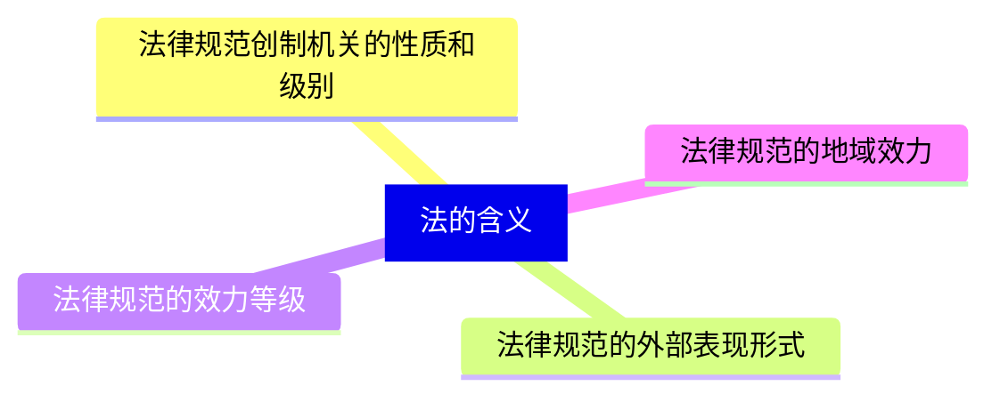
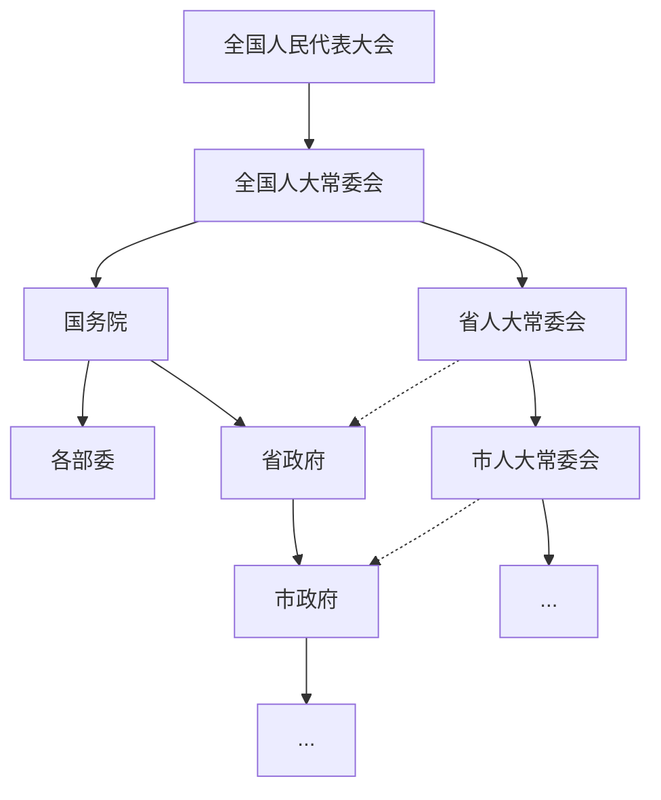
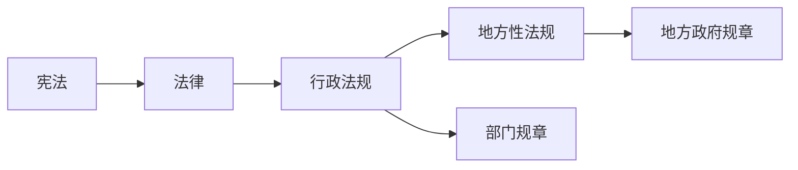
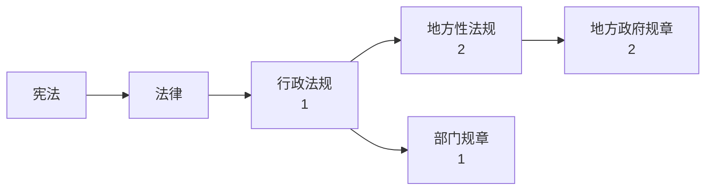
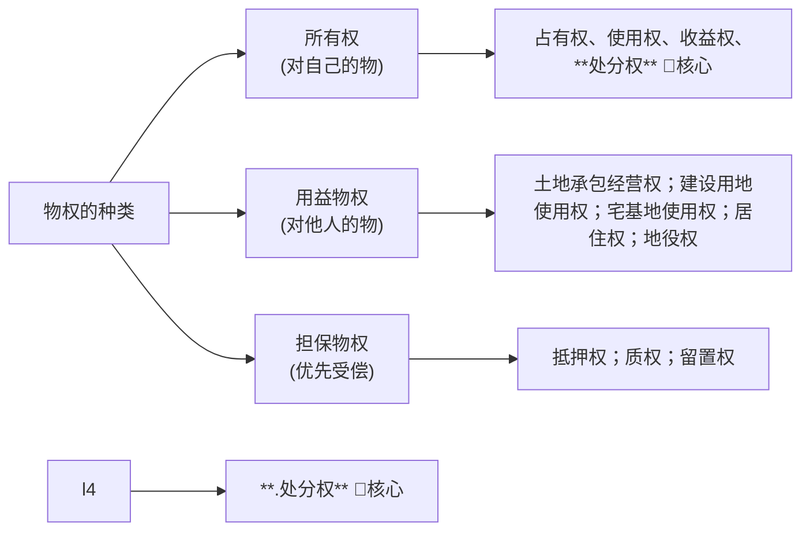

## 1.1 建设工程基本法律基础

### 1.1.1 法律部门和法律体系 [B类考点]

法律体系也称法的体系，通常指由一个国家现行的根据调整的社会关系不同，可以划分为宪法及相关法部门、民商法部门、经济法部门、社会法部门、行政法部门、刑法部门、诉讼和非诉讼程序法等7个法律部门。


| 法律部门 | 内容 | 举例 |
|:---:|:---:|:---:|
| 宪法及宪法相关法 | 与国家大事相关 | 《中华人民共和国宪法》《全国人民代表大会和地方各级人民代表大会选举法》《全国人民代表大会组织法》《国籍法》等 |
| 民法商法 | 平等主体（民-民） 商事活动（商-商） | 《民法典》《公司法》 |
| 行政法 | 行政监督 行政内部 | 《行政许可法》《行政处罚法》 |
| 经济法 | 国家在协调、干预的经济关系 | 《反垄断法》《价格法》 |
| 社会法 | 劳动关系、社会保障和社会福利 | 《劳动法》《社会保险法》 |
| 刑法 | 犯罪 | 《刑法》 |
| 诉讼与非诉讼程序法 | 规范诉讼程序 | 诉讼法：《民事诉讼法》《刑事诉讼法》 非诉讼程序法：《仲裁法》 |


根据制定机关和效力层级不同，可以划分为法律、行政法规、地方法规、部委规章和地方政府规章等。

### 1.1.2 法的形式和效力层级 [A类考点] 🌟🌟🌟

#### 1. 法的形式

法的形式是指法律的创制方式和外部表现形式。


| 法的形式 | 创制机关 | 外部表现形式（名称） | 具体规定 |
|:---:|:---:|:---:|:---:|
| 宪法 | 全国人大 | 《中华人民共和国宪法》 | 最高效力的根本法 |
| 法律 | 全国人大及常委会 | 《民法典》《xx法》 | 下列事项只能制定法律（涉及国情、民生、税收、人身自由） |
| 行政法规 | 国务院 | 《xx条例》 | 根据宪法和法律制定行政法规 |
| 地方性法规（单行条例/自治条例） | 省级、设区的市级人大及常委会（自治州、自治县） | 《地名+xx条例》 | 在不同上位法相抵触的前提下，可以制定地方性法规 |
| 部门规章 | 国务院各部委 | 《xx规定/办法/实施细则》 | 根据法律和国务院的行政法规、决定、命令，在本部门的权限范围内制定规章 |
| 地方政府规章 | 省级、设区的市级政府 | 《地名+xx规定、办法、实施细则》 | 根据法律、行政法规和本省、自治区、直辖市的地方性法规制定规章 |
| 国际条约 | —— | 《xx公约/条约/协议/宪章/盟约》 | 国际法的重要组成部分 |


我国法的形式仅限于制定法（成文法），不包括判例法、习惯法等。

#### 2. 法的效力层级

##### 法的纵向冲突

**注意例外：** 根据授权制定的法规，与法律不一致时，不按上下位处理。由全国人大常委会裁决。

##### 法的横向冲突


| 制定机关 | 冲突情形 | 冲突解决 |
|:----------:|:----------:|:----------:|
| 同一机关制定 | 新的与旧的冲突 | 按新的 |
| ^ | 特别的与一般的冲突 | 按特别的 |
| ^ | 新的一般与旧的特别 | 不按新也不按特别 谁制定谁裁决 |
| 法律之间新的一般与旧的特别不一致 | < | 全国人民代表大会常务委员会裁决 |
| 行政法规之间新的一般与旧的特别不一致 | < | 国务院 |
| 不同机关制定 | 地方法规与部门规章冲突 （国务院提出意见） | 国务院认为应适用地方法规，国务院决定  国务院认为应当适用部门规章，提请全国人大常委会裁决 |
| ^ | A部门规章与B部门规章冲突 | 国务院裁决 |
| ^ | 部门规章与地方政府规章冲突 | ^ |
| 授权制定的法规与法律规定不一致 | < | 全国人民代表大会常务委员会裁决 |


##### 法的备案审查

行政法规、地方性法规、规章等，都应在公布后30日内报有关机关备案（注意：先公布后备案）。

数字代表向上几个部门来备案。


| 法的形式 | 制定机关 | 备案审查机关 |
|----------|----------|--------------|
| 法律 | 全国人大及常委会 | 无需备案 |
| 行政法规 | 国务院 | 全国人大常委会 |
| 地方性法规 | 省级、设区的市级人大及常委会 | 全国人大常委会+国务院 |
| 部门规章 | 国务院各部委 | 国务院 |
| 地方政府规章 | 省级、设区的市级政府 | 本级人大常委会+国务院 |
| 根据授权制定的法规 | 授权机关 | 该授权机关 |


## 1.2 建设工程物权制度

### 1.2.1 物权的设立、变更、转让、消灭和保护

#### 1. 物权的设立、变更、转让、消灭

##### 不动产物权

- 不动产物权的设立、变更、转让和消灭，自记载于不动产登记簿时发生效力。未经登记，不发生效力（一般规则），但法律另有规定的除外（例外规则）。
- 依法属于国家所有的自然资源，所有权可以不登记。不动产登记，由不动产所在地登记机构办理。不动产登记费按件收取，不得按照不动产的面积、体积或者价款的比例收取。
- 不动产权属证书与不动产登记簿记载内容不一致的，除有证据证明登记簿内容确有错误的外，以登记簿为准。

##### 物权效力与合同效力区分的原则

- **不动产物权**，由《物权编》评价；
  - 自办理物权登记时生效；不登记，不发生物权效力。
- **不动产合同**，由《合同编》评价；
  - 自合同成立时生效；未办理物权登记的，并不影响合同效力。

##### 动产交付

- 动产物权的设立和转让，自交付时发生效力（一般规则），但法律另有规定的除外（例外规则）。

**例外情况：**

- **简易交付**：动产物权设立和转让前，权利人已经占有该动产的，物权自民事法律行为生效时发生效力。
- **指示交付**：动产物权设立和转让前，第三人占有该动产的，负有交付义务的人可以通过转让请求第三人返还原物的权利代替交付。
- **占有改定**：动产物权转让时，当事人又约定由出让人继续占有该动产的，物权自该约定生效时发生效力。

#### 2. 物权保护请求权

- 物权受到侵害的，权利人可以通过和解、调解、仲裁或诉讼途径解决。
- 侵害物权，除承担民事责任外，还应依法承担行政责任，构成犯罪的，追究刑事责任。
- 权利人可以请求损害赔偿，或追究其他民事责任。


| 类型 | 情形 | 保护方式 |
|------|------|----------|
| 一般规定 | 物权受到侵害 | 权利人可以通过和解、调解、仲裁或诉讼途径解决 |
| 具体规定 | 归属、内容发生争议 | 请求确认权利 |
| ^ | 无权占有 | 请求返还原物 |
| ^ | 妨害物权 | 请求排除妨害 |
| ^ | 可能发生侵害 | 请求消除危险 |
| ^ | 造成毁损 | 请求修理、重作、更换 |
| ^ | 造成毁损 | 请求恢复原状 |
| 适用原则 | 物权保护方式 | 可以单独适用，也可以合并适用 |


### 1.2.2 物权的种类 [A类考点]

### 1.2.3 用益物权

#### 1. 用益物权的一般规定

- 用益物权是权利人对他人所有的不动产或者动产，依法享有"占有、使用、收益"的权利。
- 包括土地承包经营权、建设用地使用权、宅基地使用权、居住权和地役权。

#### 2. 土地承包经营权

- 耕地的承包期为三十年。草地的承包期为三十年至五十年。林地的承包期为三十年至七十年。承包期限届满由土地承包经营权人依法继续承包。
- 土地承包经营权自土地承包经营权合同生效时设立，登记机构应当向土地承包经营权人发放土地承包经营权证、林权证等证书，并登记造册，确认土地承包经营权。
- 土地承包经营权人依照法律规定，有权将土地承包经营权互换、转让。未经依法批准，不得将承包地用于非农建设。

#### 3. 建设用地使用权

- 建设用地使用权可以在地表、地上或地下分别设立，设立建设用地使用权，不得损害已设立的用益物权。
- 设立建设用地使用权可以采取**出让**（卖）或**划拨**（送）两种方式。工商业、旅游娱乐、商品住宅等经营性用地，以及同一土地上有两个以上意向用地者的，应当采取**招标**、**拍卖**等**公开竞价方式**出让（卖）。
- **建设用地使用权自登记时设立**。使用权人不得改变土地用途，需要改变的，应当依法经行政机关批准。

建设用地使用权可以转让、互换、出资、赠与或抵押（注意不能质押）：

1. 使用期限由当事人约定，但不得超过建设用地使用权的剩余期限；
2. 应当申请登记；
3. 附着于该土地上的建筑物、构筑物和其他附属设施一并处分（房地一体、房地不分离）。
- 住宅用地使用权期限届满的，自动续期。
- 其他建设用地使用权，到期消灭。建设用地使用权消灭的，出让人应当及时办理注销登记。

#### 4. 宅基地使用权

- 宅基地使用权人依法对集体所有的土地享有占有和使用的权利，有权依法利用该土地建造住宅及其附属设施。
- 宅基地使用权的取得、行使和转让，适用土地管理的法律和国家有关规定。
- 宅基地因自然灾害等原因灭失的，宅基地使用权消灭。对失去宅基地的村民，应当依法重新分配宅基地。
- 已经登记的宅基地使用权转让或者消灭的，应当及时办理变更登记或者注销登记。

#### 5. 居住权

- 居住权人（甲）按合同约定，对他人（乙）的住宅享有占有、使用的用益物权，以满足生活居住的需要。甲乙应采用书面形式订立居住权合同。
- 居住权无偿设立，并自登记时设立。
- 居住权不得转让、继承。设立居住权的住宅不得出租，但是当事人另有约定的除外。
- 居住权期限届满或者居住权人（甲）死亡的，居住权消灭。居住权消灭的，应当及时办理注销登记。

#### 6. 地役权

- 地役权是当事人（甲）为提高自己不动产效益，利用他人（乙）不动产的权利。是甲乙通过合同约定设立的用益物权。需要便利的（甲）土地叫需役地，提供便利的（乙）土地叫供役地。
- 地役权是特殊的不动产物权，无需登记。自地役权合同生效时设立。（但未经登记，不得对抗善意第三人）
- 地役权期限由当事人约定，但不得超过土地承包经营权、建设用地使用权的剩余期限。
- 地役权不得单独转让、单独抵押。
- 土地承包经营权、建设用地使用权转让，地役权一并转让。土地承包经营权、建设用地使用权抵押的，在实现抵押权时，地役权一并转让。

### 1.2.4 担保物权

#### 1. 抵押权

抵押权是指为担保债务的履行，债务人或者第三人不转移财产的占有，将该财产抵押给债权人的，债务人不履行到期债务或者发生当事人约定的实现抵押权的情形，债权人有权就该财产优先受偿。

**特点：**
- 不转移占有
- 约定设立
- 需要对方同意

#### 2. 质权

质权是指为担保债务的履行，债务人或者第三人将其动产或者权利出质给债权人占有的，债务人不履行到期债务或者发生当事人约定的实现质权的情形，债权人有权就该动产或者权利优先受偿。

**特点：**
- 转移占有
- 约定设立
- 需要对方同意

#### 3. 留置权

留置权是指债务人不履行到期债务，债权人可以留置已经合法占有的债务人的动产，并有权就该动产优先受偿。

**特点：**
- 转移占有
- 法定设立
- 无需对方同意

### 1.2.5 物权种类总结 [A类考点]


| 物权类型 | 定义 | 具体种类 | 转移占有 | 设立方式 | 特点 |
|----------|------|----------|----------|----------|------|
| 所有权 | 对自己财产的完全支配权，含占有、使用、收益、处分四项权能 | 国家所有权、集体所有权、私人所有权 | - | - | 最完整的物权 |
| 用益物权 （5种） | 对他人的物的占有、使用、收益权 | 建设用地使用权、宅基地使用权、土地承包经营权、居住权、地役权（4地1居） | - | - | 限制物权 |
| 担保物权 （3种） | 对他人的物的优先受偿权 | 抵押权 | 不转移占有 | 约定（需要对方同意） | 优先受偿 |
| ^ | ^ | 质权 | 转移占有 | 约定（需要对方同意） | 欠A扣B |
| ^ | ^ | 留置权 | 转移占有 | 法定（无需对方同意） | 欠A扣A |


## 1.3 建设工程知识产权制度

### 1.3.1 著作权制度 [B类考点]

著作权，是制作者及其他著作权人依法对文学、艺术和科学作品所享有的专有权。在我国著作权等同于版权。

#### 1. 建设工程活动中常见的著作权作品

著作权保护的客体是作品，在建设工程活动中，会产生许多具有著作权的作品，主要有：

- **文字作品**
- **建筑作品**  
- **图形作品**
- **计算机软件**：工程建设中经常使用，属于著作权保护的客体

#### 2. 著作权主体


| 类型 | 著作权主体 | 举例 |
|------|------------|------|
| 单位作品 | 单位 | 招标文件、投标文件 |
| 职务作品 （一般） | 著作权由作者享有； 单位可优先使用 | / |
| 职务作品 （特殊） | 作者享有署名权； 著作权的其他权利由单位享有 | 1. 主要利用单位物质技术条件+单位承担责任的：工程或产品设计图、地图、示意图、计算机软件 2. 报纸、期刊社、通讯社、广播电台的工作人员创作的职务作品 |
| 委托作品 | 1. 合同约定 2. 未明确约定或者没有订立合同的著作权属于受托人 | 勘察设计文件 |


#### 3. 著作权的保护期


| 权利内容 | 保护期限 |
|----------|----------|
| 署名权、修改权、保护作品完整权 | **不受限制** |
| 发表权、使用权和获得报酬权 | **自然人**：作者终生及其死后50年 **法人、非法人组织**：首次发表后50年  *备注：作品自创作完成后50年内未发表的，不再受《著作权法》保护* |


### 1.3.2 专利权制度


| 知识产权 | 取得条件 | 保护期限 | 计算起点 |
|----------|----------|----------|----------|
| 发明 | 新颖性、创造性、实用性 | **20年** | 申请日 |
| 实用新型 | 新颖性、创造性、实用性 | **10年** | 申请日 |
| 外观设计 | 新颖性、美感、适于工业应用 | **15年** | 申请日 |


### 1.3.3 商标权制度

#### 1. 商标与商标专用权的概念

##### 商标

经商标局核准注册的商标为**注册商标**，包括：
- 商品商标
- 服务商标  
- 集体商标
- 证明商标

商标注册人享有商标专用权，受法律保护。

> **注意**：商标不经注册也可以使用，但未经核准注册的商标不受《商标法》保护。

##### 商标专用权

商标专用权是指自然人、法人或其他组织对其注册的商标依法享有的专用权。

#### 2. 商标专用权的内容及保护对象

1. **商标专用权包括使用权和禁止权两方面**：
   - **使用权**：商标注册人对其注册的商标充分支配和完全使用的权利；也有权转让商标使用权、签订合同许可他人使用商标
   - **禁止权**：商标注册人对其注册的商标所享有的禁止他人使用的权利

2. **商标专用权的内容只包括财产权**，商标设计者的人身权受《著作权法》保护

#### 3. 注册商标的续展、转让和使用许可

##### 续展

- 注册商标的有效期为**10年**，自核准注册之日起计算
- 商标有效期满，需要继续使用的，应当在期满前**12个月内**申请续展注册
- 在此期间未能提出申请的，可以给予**6个月的宽展期**
- 宽展期未提出申请的，注销其注册商标
- 每次续展注册的有效期为**10年**，自该商标上一届有效期满次日起算

##### 转让

转让注册商标的，转让人和受让人应当共同向商标局提出申请。商标注册人对其在同一种商品上注册的近似商标，或者类似商品上注册的相同或者近似的商标，应当**一并转让**。

##### 使用许可

注册商标的使用许可是指商标注册人通过签订商标使用许可合同，许可他人使用其注册商标的法律行为。经许可使用他人注册商标的，必须在使用该注册商标的商品上标明被许可人的名称和商品产地。

## 1.4 建设工程债权制度

### 1.4.1 债的概念和分类

债是按照合同的约定或者依照法律的规定，在当事人之间产生的特定的权利和义务关系。

#### 债的分类


| 分类标准 | 类型 | 说明 |
|----------|------|------|
| 发生原因 | 合同之债 | 基于合同关系产生 |
| ^ | 侵权之债 | 基于侵权行为产生 |
| ^ | 无因管理之债 | 基于无因管理行为产生 |
| ^ | 不当得利之债 | 基于不当得利产生 |
| 主体数量 | 单一之债 | 债权人和债务人均为一人 |
| ^ | 多数人之债 | 债权人或债务人为多人 |


### 1.4.2 建设工程合同

建设工程合同是承包人进行工程建设，发包人支付价款的合同。

#### 建设工程合同的特征

1. **标的的特殊性**：建设工程合同的标的是建设工程
2. **主体的特定性**：承包人必须具备相应的资质
3. **形式的要式性**：应当采用书面形式
4. **履行的长期性**：建设工程周期较长

## 1.5 建设工程税收制度

### 1.5.1 企业所得税

#### 1. 纳税人

包括居民企业和非居民企业，但不包括个人独资企业、合伙企业，这两类交个税。

#### 2. 居民企业（两类）

1. 境内成立的企业。
2. 境外成立但其实际管理机构、总机构在该国境内的企业。

例如，在中国注册成立的沃尔玛（中国）公司和通用汽车（中国）公司都是中国的居民企业。A公司注册在开曼群岛，但如果实际管理机构在中国，也是中国居民企业。
居民企业需要就其来源于中国境内和境外的所得缴税。

#### 3. 非居民企业（两类）

1. 境外成立且实际管理机构不在中国境内，但在中国境内设立机构、场所的企业。这一类非居民企业，应当就来源于境内的所得，及发生在境外但与境内机构和场所有实际联系的所得，按照规定税率缴纳企业所得税。
2. 境外成立，在中国境内没有实际管理机构，也未设立机构、场所，但有来源于中国境内所得的。这一类非居民企业，应当就来源于中国境内的所得按照规定税率缴纳企业所得税。

#### 4. 应纳税收入

1. 销售货物收入；
2. 提供劳务收入；
3. 转让财产收入；
4. 股息、红利等权益性投资收益；
5. 利息收入；
6. 租金收入；
7. 特许权使用费收入；
8. 接受捐赠收入；
9. 其他收入。

#### 5. 不征税收入

1. 财政拨款；
2. 行政事业性收费、政府性基金；
3. 其他。

#### 6. 应纳税所得额

$$应纳税所得额=收入总额-不征税收入-免税收入-各项扣除-弥补以前年度亏损$$

#### 7. 税率

一般为25%。

### 1.5.2 企业增值税

#### 1. 增值税的概念和特点

增值税是以商品（含应税劳务、应税服务）在流转过程中产生的增值额作为计税依据而征收的一种流转税。

#### 2. 增值税纳税人

分为一般纳税人和小规模纳税人。

- **一般纳税人**：应纳税额（抵扣法）= 当期销项税额（销售额 × 税率）- 当期进项税额
- **小规模纳税人**：应纳税额（简易法）= 销售额 × 征收率（不得抵扣进项税额）

#### 3. 增值税发票

分为普通发票和专用发票。

下列情形之一的，不得开具增值税专用发票：
1. 应税销售行为的购买方为销售者个人的；
2. 发生应税行为使用免税规定。

#### 4. 可以抵扣的进项税额

1. 从销售方取得的增值税专用发票上注明的增值税额。
2. 从海关取得的海关进口增值税专用缴款书上注明的增值税额。
3. 自境外单位或者个人购进劳务、服务、无形资产或者境内的不动产，从税务机关或者扣缴义务人取得的代扣代缴税款的完税凭证上注明的增值税额。

#### 5. 不得抵扣的进项税额

1. 简易计税方法计税项目、免增值税项目、集体福利或者个人消费的购进货物、劳务、服务、无形资产和不动产；
2. 非正常损失的购进货物，以及相关的劳务和交通运输；
3. 其他。

### 1.5.3 环境保护税

环境保护税是对在我国领域和管辖的其他海域直接向环境排放应税污染物的企业事业单位和其他生产经营者征收的一种税。

#### 环境保护税的特点

1. **征税对象特定**：直接向环境排放应税污染物的单位和个人
2. **计税依据明确**：以污染物排放量或噪声分贝数为计税依据
3. **税率差异化**：根据污染物种类和浓度实行差别税率

### 1.5.4 个人所得税

个人所得税是对个人取得的各项应税所得征收的一种税。

#### 个人所得税的纳税人

- **居民个人**：在中国境内有住所，或者无住所而一个纳税年度内在中国境内居住累计满183天的个人
- **非居民个人**：在中国境内无住所又不居住，或者无住所而一个纳税年度内在中国境内居住累计不满183天的个人

#### 个人所得税的征税范围

1. **工资、薪金所得**
2. **劳务报酬所得**
3. **稿酬所得**
4. **特许权使用费所得**
5. **经营所得**
6. **利息、股息、红利所得**
7. **财产租赁所得**
8. **财产转让所得**
9. **偶然所得**

---

*本章介绍了建设工程基本法律知识，包括法律体系、物权制度、债权制度、知识产权制度、担保制度、保险制度和法律责任制度等基本内容。*
