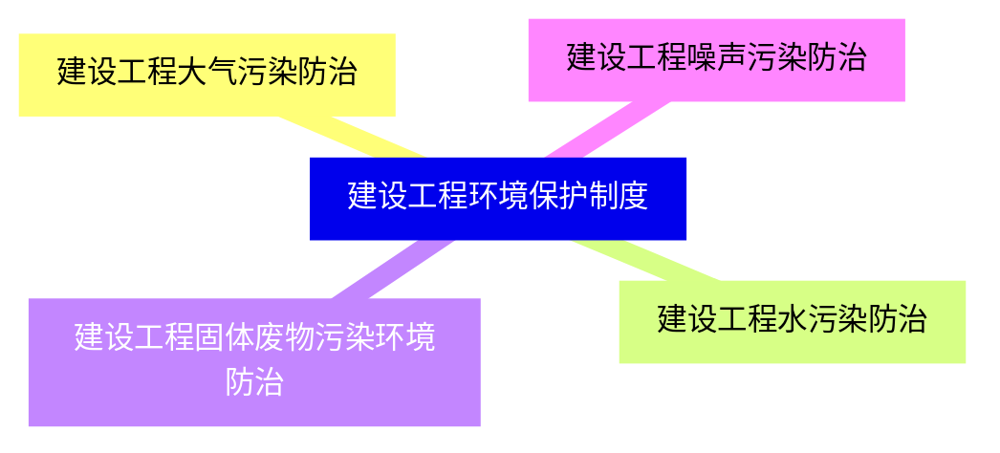

## 主要内容
- 建设工程环境保护制度    (2-3分)
- 施工中历史文化遗产保护制度  (2-3分)

## 8.1 建设工程环境保护制度

### 1. 建设工程大气污染防治 [B类考点]
1. 建设单位的扬尘污染防治责任
**建设单位**应当将防治扬尘污染的费用列入工程造价，并在施工承包合同中明确**施工单位**扬尘污染防治责任。
暂时不能开工的，建设单位应当对裸露地面进行覆盖；**超过 3 个月**的，应当进行绿化铺装或者遮盖。
2. 施工单位的扬尘污染防治责任
    1. 对施工单位现场实行封闭管理:
        - 城市范围内**主要道路**的施工工地应设置高度 **≥2.5 米** 的封闭围挡，
        - 一般路段的施工工地应设置高度≥1.8 米的封闭围挡。
    2. 加强物料管理:
        - 施工现场的建筑材料\构件\料具应按总平面布局进行码放
        - 在规定

### 2. 建设工程水污染防治
### 3. 建设工程固体废物污染环境防治
### 4. 建设工程噪声污染防治
