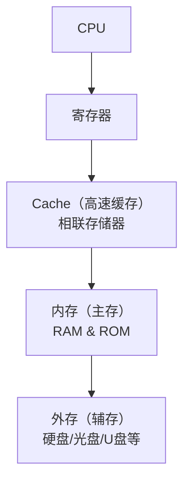
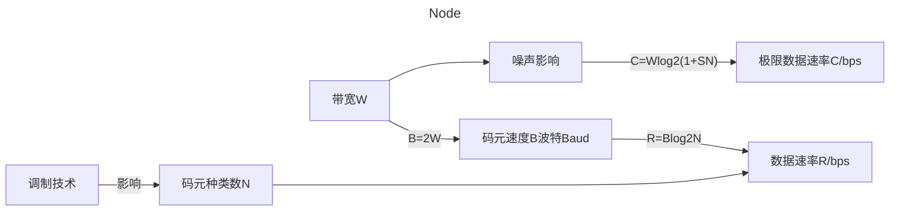

网络管理员是软考初级资格考试中的一个重要科目，主要考查计算机网络基础知识和网络管理技能。

## 考试大纲

### 考试要求

- 掌握计算机网络基础知识
- 了解网络协议和网络设备
- 具备网络配置和管理能力
- 掌握网络安全基础知识

### 考试科目

- **上午考试**：基础知识（75分，150分钟）
- **下午考试**：应用技术（75分，150分钟）


## 1. 计算机硬件基础

### 数据的表示

#### R进制

每一位R进制可以表示R个数值，分别为 0 ~ R-1。

| R进制 | 1位可表示的数 | 后缀表示法 | 下标表示法 |
|-------|--------------|-----------|-----------|
| 二进制 | 0,1 | (10)B | (10)₂ |
| 八进制 | 0,1,2,3,4,5,6,7 | (10)O | (10)₈ |
| 十进制 | 0,1,2,3,4,5,6,7,8,9 | (10)D | (10)₁₀ |
| 十六进制 | 0,1,2,3,4,5,6,7,8,9,A,B,C,D,E,F | (10)H | (10)₁₆ |

#### R进制转十进制

二进制、八进制和十六进制向十进制转换都非常容易，就是"按权相加"。所谓"权"，也即"位权"。

**二进制转十进制**

```
11010 = 1×2⁴ + 1×2³ + 0×2² + 1×2¹ + 0×2⁰ = 26₁₀
```

**八进制转十进制（含小数）**

```
423.5176 = 4×8² + 2×8¹ + 3×8⁰ + 5×8⁻¹ + 1×8⁻² + 7×8⁻³ + 6×8⁻⁴ = 275.65576171875
```

#### 十进制转R进制

短除法示例：

以十进制数156转换为二进制为例：

1. 用2去除156，得到商78，余0
2. 用2去除78，得到商39，余0
3. 用2去除39，得到商19，余1
4. 用2去除19，得到商9，余1
5. 用2去除9，得到商4，余1
6. 用2去除4，得到商2，余0
7. 用2去除2，得到商1，余0
8. 用2去除1，得到商0，余1

把余数倒过来写，就是：10011100

所以，156₁₀ = 10011100₂

同理，十进制数156转八进制：

1. 用8去除156，得到商19，余4
2. 用8去除19，得到商2，余3
3. 用8去除2，得到商0，余2

倒写余数，得到234

所以，156₁₀ = 234₈

| 十进制 | 二进制  | 八进制 | 十六进制 |
|-------|--------|-------|---------|
| 0     | 0000   | 0     | 0       |
| 1     | 0001   | 1     | 1       |
| 2     | 0010   | 2     | 2       |
| 3     | 0011   | 3     | 3       |
| 4     | 0100   | 4     | 4       |
| 5     | 0101   | 5     | 5       |
| 6     | 0110   | 6     | 6       |
| 7     | 0111   | 7     | 7       |
| 8     | 1000   | 10    | 8       |
| 9     | 1001   | 11    | 9       |
| 10    | 1010   | 12    | A       |
| 11    | 1011   | 13    | B       |
| 12    | 1100   | 14    | C       |
| 13    | 1101   | 15    | D       |
| 14    | 1110   | 16    | E       |
| 15    | 1111   | 17    | F       |
| 16    | 10000  | 20    | 10      |

### 进制转换总结


| 进制转换类型 | 整数转换规则（从右往左）| 小数转换规则（从左往右）|
|---|---|---|
|二进制转八进制|每 3 位二进制转 1 位八进制|每 3 位二进制转 1 位八进制|
|二进制转十六进制|每 4 位二进制转 1 位十六进制|每 4 位二进制转 1 位十六进制|
|八/十六进制转二进制|每 1 位八进制转 3 位二进制<br>每 1 位十六进制转 4 位二进制||


### 原码、反码和补码

- **原码**  
  原码是符号位加上绝对值本身的二进制表示方法。最高位为符号位（0表示正数，1表示负数），其余位表示数值的绝对值。

- **反码**  
  反码是在原码的基础上，符号位不变，正数的反码和原码相同，负数的反码是符号位不变，其余各位取反（0变1，1变0）。

- **补码**  
  补码是对反码加1得到的。正数的补码与原码和反码都相同，负数的补码等于其反码加1。补码是计算机中用于表示和运算有符号数的主要方式。


||正数|负数|
|---|---|---|
|原码|最高位添加符号位 0|最高位添加符号位 1|
|反码|与原码相同|保持其原码符号位不变，数值按位取反|
|补码|^|取其反码+1|

**示例（以8位为例）：**

| 十进制 | 原码           | 反码           | 补码           |
|-------|---------------|---------------|---------------|
| +1    | 0000 0001     | 0000 0001     | 0000 0001     |
| -1    | 1000 0001     | 1111 1110     | 1111 1111     |
| 1+(-1)| 0000 0000     | 0000 0000     | 0000 0000     |
| +0    | 0000 0000     | 0000 0000     | 0000 0000     |
| -0    | 1000 0000     | 1111 1111     | 0000 0000     |

- 正数：三者表示都相同。
- 负数：反码=原码符号位不变，其它位取反；补码=反码+1。

### 结论

1. 补码的符号位可以和数值位一起参加运算，结果不会出错
2. 补码的 0 表示唯一，另外移码的 0 表示也唯一
3. 在计算机中均采用补码表示

## 计算机体系结构

### 冯·诺伊曼体系结构

> **冯·诺伊曼体系结构（Von Neumann Architecture）**：  
> 把计算机分为输入设备、输出设备、存储器、控制器和运算器五大部分。存储程序和数据在同一存储器中，采用顺序执行、统一控制的方式完成数据处理任务。

- 主要特点：
    - 指令和数据存储于同一个存储器，用地址区分
    - 具有输入、输出设备
    - 以控制器为核心，统一协调管理各部件
    - 采用顺序（流水）执行方式

```mermaid
flowchart LR
    input[输入设备]
    output[输出设备]
    memory[存储器]
    control[控制器]
    alu[运算器]
    cpu[中央处理单元 (CPU)]
    input -- 数据/指令 --> memory
    output <-- 数据/结果 -- memory
    memory <-- 指令/数据流 --> cpu
    cpu --> alu
    cpu --> control
    alu <--> control
    cpu -- 结果/命令 --> output
    input -- 控制信号 --> control
```

#### 运算器和控制器（中央处理器 CPU 的两大核心部件）


|运算器|<|
|---|---|
|算数逻辑单元 ALU|执行算数和逻辑运算|
|累加寄存器 AC|暂时存放运算的中间结果|
|数据缓冲寄存器|存放一条指令或数据|
|状态条件寄存器|保存运算中的标志位信息|



|控制器|<|
|---|---|
|程序计数器 PC|存放下一条指令的地址|
|指令寄存器 IR|存放当前正在执行的指令|
|指令译码器|分析指令中的操作码|
|时序部件|控制各部件之间的有序协调|


### 存储器

存储器可分为主存储器（简称主存或内存）和辅助存储器（简称辅存或外存）两大类，和 CPU 直接交换信息的是主存。

#### 1. 主存储器（Main Memory）

其作用是存放指令和数据，并能由 CPU 直接随机存取。CPU 和主存储器构成主机。

#### 2. 辅助存储器

用于存放一些需要长期保存的程序或数据，断电后也不会丢失，容量比较大但存取速度慢。

### 输入设备（Input Device）

输入设备用于将外部信息输入到计算机系统中。

### 输出设备（Output Device）

输出设备用于将计算机处理后的结果输出到外部。

### 计算机总线

计算机各种功能部件之间传送信息的公共通讯干线。


|总线|功能|<|
|---|---|---|
|数据总线|数据总线宽度|CPU 一次读取的二进制位数（字长）|
|^|数据总线带宽|单位时间内总线上传的数据量|
|地址总线|地址总线宽度|决定了寻址的空间大小，也称地址总线的根数<br>地址总线宽度：计算机可寻址范围(2^n)|
|控制总线||传输控制信号|


## 指令系统

### 指令系统基本概念

指令系统是计算机硬件的语言系统(二进制)，它描述了计算机内全部的控制信息和"逻辑判断"能力，不同计算机的指令系统包含的指令种类和数目也不同。为提高计算机处理指令的效率，通常采用流水线技术进行指令并行以达到效率提高的目的（并行执行）。

### 寻址方式

一条完整的指令包括操作码和地址码，程序被启动时，程序所包含的指令和数据都被装入到内存中。在程序指令执行的过程中，需要取指令和操作数。确定指令存放位置的过程称为指令寻址，确定操作数存放位置的过程称为数据寻址。采用多种寻址方式可以增加用户编程的灵活性。

| 寻址方式 | 特点 | 说明 |
|---------|------|------|
| 立即寻址 | 最快 | 操作数就在指令中，指令中直接给出要用的数据本身。 |
| 变址寻址 | 需要计算 | 指令中给出一个变址寄存器和一个地址字段，实际地址等于地址字段与变址寄存器内容之和，常用于数组元素访问。 |
| 直接寻址 | - | 指令中给出的地址字段就是操作数的实际存放地址。 |
| 间接寻址 | 多次查找（内存-内存） | 指令中给出的地址字段不是操作数的实际地址，而是指向存有操作数实际地址的内存单元，需经一次间接访问。 |
| 寄存器寻址 | - | 指令中指定操作数在某个寄存器中，操作速度最快。 |
| 寄存器间接寻址 | 多次查找（寄存器—内存） | 指令中指定的寄存器内存放着操作数的实际地址，通过该寄存器间接访问内存单元。 |

## 存储系统

### 多级存储结构

#### 非易失性存储器

- **ROM（Read-Only Memory，只读存储器）**
  - **PROM**：可编程只读存储器
  - **EPROM**：紫外线可擦可编程只读存储器
  - **EEPROM**：电可擦可写只读存储器
- **FLASH**：可读可写的闪存，常用于存储卡、U 盘等
- **光盘**
- **软盘**
- **硬盘**

#### 易失性存储器（RAM，Random Access Memory，随机存取存储器）

- **DRAM（动态随机存储器）**：需要定期刷新充电
- **SRAM（静态随机存储器）**：不需要定期刷新充电

---

#### 存储层次结构速度与关系



- **快** ：CPU → 寄存器 → Cache（按内容存取/相联存储器）→ 内存（RAM 和 ROM）
- **慢** ：外存（辅存，如硬盘、光盘、U 盘等）

---

**多级存储系统的划分目的**：  
为解决存储容量、成本和速度三者之间的矛盾问题，通过分层结构兼顾容量大、速度快与低成本的需求。


### 主存

主存包括随机存储器 RAM 和只读存储器 ROM，主要由 DRAM 组成。其作用是存放指令和数据，并能由中央处理器(CPU)直接随机存取。


|主存||可读可写|掉电丢失|需要动态刷新|
|---|---|---|---|---|
||ROM|只读|否|-|
|RAM|SRAM|是|是|否|
|^|DRAM|是|是|是|


#### 编址方式

主存储器(内存)采用随机存取方式存储，需对每个存储单元进行编址。而存储单元通常以 word(字或字节)为单位进行标识，即每个字一个地址编号，地址编号通常采用 16 进制进行表示。

#### 存储容量表示的相关单位

|单位|功能描述|
|---|---|
|位 bit|1bit 表示一个二进制字节|
|字节 B|1B=8bit|
|字 |通常为字节的整数倍，常见的字长有：8/16/32/64bit<br>实际表示 CPU 一次处理的二进制的位数|

**单位换算：**

- 1K = 2^10
- 1M = 2^20
- 1G = 2^30

### Cache

Cache 高速缓冲寄存器是位于 CPU 和主存之间容量较小但速度很高的存储器，通常由 SRAM 组成。

Cache 利用局部性原理，将主存中可能被访问的内容调入速度更快的 Cache 中，以解决 CPU 和主存之间速度不匹配的问题，主存与 Cache 之间的地址映射直接由硬件自动完成，可以在一定程度上提升计算机性能。

**注意**：CPU 在 Cache 中访问命中的概率会受 Cache 容量、数据调用的输入输出算法等影响。

#### Cache 和主存间的映像方式

主存与 cache 的地址映射方式有三种：直接方式、全相联方式和组相联方式。

- **直接相联**：将一个主存块存储到唯一的一个 Cache 行(固定映射)
- **全相联**：将一个主存块存储到任意一个 Cache 行(随机映射)
- **组相联**：将一个主存块存储到唯一的一个 Cache 组中任意一个行(范围内随机)

||冲突率|电路复杂度|
|---|---|---|
| 直接相联 | 高 | 简单 |
| 全相联 | 低 | 复杂 |
| 组相联 | 中 | 折中 |


### 硬盘

硬盘用于存储大量数据，且掉电不丢失。

#### 硬盘分类

- **HDD（Hard Disk Driver）**：传统硬盘，即机械硬盘。构成由磁头+盘片组成，每个盘面划分成多个同心圆环的磁道，每个磁道又划分成多个扇区。
- **SSD（Solid State Driver）**：固态硬盘，由控制单元和固态存储单元（DRAM 或 Flash 芯片）组成。

||启动速度|读写速度|噪音|成本|寿命|
|---|---|---|---|---|---|
| HDD | 慢 | 慢 | 有 | 低 | 长 |
| SSD | 快 | 快 | 无 | 高 | 短 |

#### 虚拟化技术

| 层次 | 主要作用 | 实现方式 |
|------|---------|---------|
| 主存-辅存层次 | 扩大主存空间 | 软、硬件 |

#### 磁盘性能指标

| 性能指标 | 功能描述 |
|---------|---------|
| 磁盘转速 | 硬盘内电机主轴的旋转速度，常见的有 5400rpm、7200rpm 等 |
| 磁盘容量 | 磁盘可存储数据空间，常见的有 500GB、1TB、2TB 等 |
| 平均寻道时间 | 磁头从开始移动到数据所在的磁道所花费时间的平均值 |
| 平均等待时间 | 磁头已处于要访问的磁道，等待所要访问的扇区旋转至磁头下方的时间平均值 |
| 平均访问时间 | 寻道时间 + 平均等待时间 |

#### 存储系统的数据存储方式

| 存储类型 | 特点 | 设备 |
|---------|------|------|
| 相联存储 | 按内容存储 | Cache |
| 随机存储 | 有地址，与位置无关 | 内存、U 盘 |
| 直接存储 | 有地址，与位置有关 | 磁盘、软盘、光盘 |
| 顺序存储 | 无地址 | 磁带 |


## 2. 数据通信技术

### 通信系统概述

通信系统的基本概念
通信是发送者(人或机器)和接收者之间通过某种媒体进行的信息传递。
结论:本质就是在一点精确或近似地再生另一点的信息。


信源：把代传输的消息转换成原始电信号
发送器：将信源和信道特性相匹配。如调制和编码
信道：是一种物理戒指，是信号传输的通道。
接收器：将信号放大和反转换（如译码、解调等）其目的是从收到减损的接收信号中正确恢复出原始电信号
信宿：把原始电信号还原成相应消息

三要素：信源、信道、信宿
五要素：信源、发送器、信道、接收器、信宿

信道传输的方式

|信号|特点|示例|
|---|---|---|
|模拟信号|也成为连续信号，一定的时间范围内可以有无限多个不同的值|麦克风输出的电压|
|数字信号|在取值上是离散的、不连续的信号|电报信号、计算机输入、输出信号|

### 多路复用技术

多路复用技术是把多个低速信道组合成一个高速信道的技术，它可以有效地提高数据链路的利用率，从而使得一条高速的主干链路同时为多条低速的接入链路提供服务，也就是使得网络干线可以同时运载大量的语音和数据传输。

根据复用原理的不同，可划分为不同的复用技术，常见的有:

1、空分复用(SDM)
指利用空间的分割来实现的复用，进而让同一频段的信号能在不同的子信道内传输。
常见应用如:光缆。

2、频分复用(FDM)
指通过信号的不同频率范围划分子信号，如 FM 电台

3、波分复用(WDM)
以不同的光波长来划分子信道，如光纤

4、时分复用(TDM)
以信道的传输时间作为分割对象(划分时间片)来实现的复用，并且可以根据时间片是否固定分配，分为同步时分复用技术和统计时分复用技术(STDM)。



|名称|技术原理|速率|帧长|子信道|子信道速率|
|---|---|---|---|---|---|
|E1载波|同步时分复用|2.048Mbps|256bit|32|64Kbps|
|T1载波|^|1.544Mbps|193bit|24|^|

采样频率 8000Hz  采用周期为 125us

5、码分复用(CDM)
利用不同的码序列来区分不同的用户信号的复用技术，常见应用:CDMA、WCDMA
等移动通信系统。

信道容量计算
理想无噪声信道的信道容量，奈奎斯特公式 R=Blog2N
有噪声连续信号的信道容量，香农公式 C=Wlog2(1+S/N)

在数字通信中常常用时间间隔相同的符号来表示一个二进制数字，这样的时间间隔内的信号称为(二进制)码元。
 


数字调制技术

数字调制:用数字信号调制模拟信号，在模拟信道中进行数据传输。
|调制技术|说明|码元种类|比特位|特点|
|---|---|---|---|---|
|ASK 幅移键控|用恒定的载波振幅和无载波表示 0、1|2|1|实现简单、但抗干扰性能差、效率低|
|FSK 频移键控|用载波频率(fc)附近的两个频率(f1、f2)表示两个不同值|2|1|抗干扰性能较 ASK 更强，但占用带宽较大|
|PSK<br>DPSK<br>相位键控|用载波的相位便宜来表示 0、1|2|1|抗干扰性能好，且相位的变化可以作为定时信息来同步时钟|
|4DSPK|四差分相移键控|4|2|每个 90° 表示一种状态|
|QPSK|正交相移键控|4|2|每个 90° 表示一种状态|
|QAM|正交幅移键控|16|4|ASK 和 PSK 技术结合|

码元种类数N 与比特为之间的关系可通过下列方法计算
1. 内奎斯特公式 R=Blog2N
2. 由调制技术确定码元种类数
3. 根据一致数据速率逆推码元种类数得到调制技术


PCM脉冲编码调制技术
PCM 系统主要包括：采样、量化与编码三个过程

数字编码与编码效率

基本编码：归零码、不归零码（100% 的编码效率）与双向码

应用性编码——Manchester 编码
标准曼彻斯特编码
曼彻斯特编码
差分曼彻斯特编码

编码效率

|编码方案|说明|效率|典型应用|
|---|---|---|---|
|曼彻斯特编码|每传输1bit 的信息，就要求线路上有两次电平状态变化(2Baud)|50%|10M 以太网|
|差分曼彻斯特编码|^|^|令牌环网|
|4B/5B|用 5 位代码表示 4 位有效信息与不归零编码(NRZ-I)配合使用|80%|100Base-FX<br>FDDI|
|8B/10B|^|^|1000Base-X<br>1000Base-T|
|8B/6T|用 6 个代码表示 8 位有效信息|0.75 波特/位|100Base-T4|


差错控制
1、奇偶校验
校验方法:在信息码后增加一位校验位，确保整个数据码中1的个数为奇数(偶数)检错码的构造:检错码三信息字段十校验字段。

接收方检验原理:
将所有数据位进行模2加运算，偶校验运算结果为0，奇校验运算结果为1，视为据数据无误。
例如:信息码为0110001，问校验位为类值()，可构成奇校验。
即满足0⊕1⊕1⊕0⊕0⊕0⊕1  C8=1,导到C8=0，即校验位为数值0。

2、海明校验
用冗余数据位来检测和纠正代码差错的理论和方法，特点:
校验位数量:由2^k>m+k+1决定，其中m为信息码位数，k为校验码位数校验位位置:在2的幂次方位置上
隐藏条件:偶校验，确定校验位数值

3、CRC校验
是以太网(802.3)中常用的一种差错控制技术。其特征是信息字段和校验字段的长度可以任意选定，只检错，不纠错。
校验码长度:多项式最高次的幂值
校验码数值:借助于多项式除法，其余数为校验码

## 3. 广域网与接入网技术

### 计算机网络定义
计算机网络定义为“以能够相互共享资源内方式互连起来的自治计算机系统的集合
主要表现在如下几点:
- 目的是实现计算机资源的共享
- 分布在不同地理位置的多台独立的“自治计算机” 
- 通信必须遵循共同的网络协议

### OSI参考模型
OSI模型也称开放式系统互联模型，是由国际标准化组织在20世纪80年代早期制定的一套普遍适用的规范集合，使全球范围的计算机可进行开放式通信
应用层
 ｜
表示层
 ｜
会话层
 ｜
传输层
 ｜
网络层
 ｜
数据链路层
 ｜
物理层

对等层上协议一致，下层位上层提供服务

OSI 参考模型个层次的功能

|层次|主要功能|
|---|---|
|应用层|针对每个特定应用都协议和功能|
|表示层|设备固有的数据格式和网络标准数据格式的转换|
|会话层|负责通信连接的建立和断开|
|传输层|管理两个节点之间的数据可靠传输，确保数据可靠到达目的地(流量控制、分片与重组)TCP UDP|
|网络层|路由选择 IP|
|数据链路层|负责物理层上互联设备之间的通信 数据帧和比特流转换 mac|
|物理层|主要负责比特流(0 1)与电压的高低、光的闪灭之间的互换|

OSI 参考模型数据封装与解封装

### TCP/IP 参考模型


OSI 七层模型与 TCP/IP 四层模型虽然结构不同，但很多功能是相互对应的。下表展示了两者在各层功能上的映射关系：

| OSI 七层模型      | TCP/IP 四层模型    | 主要功能说明               |
|-------------------|-------------------|----------------------------|
| 应用层            | 应用层            | 提供网络服务与应用接口（如 HTTP、FTP、SMTP、DNS 等）|
| 表示层            |                   | 数据格式转换、数据加密与解密 |
| 会话层            |                   | 建立、管理和终止会话连接    |
| 传输层            | 传输层            | 端到端的数据传输、差错控制、流量控制（TCP/UDP）|
| 网络层            | 网际层            | 路由选择和逻辑寻址（IP）    |
| 数据链路层        | 网络接口层        | 数据帧传输、介质访问控制    |
| 物理层            | 网络接口层        | 比特流的物理传输            |

注意：TCP/IP 的应用层包含了 OSI 的应用层、表示层和会话层的全部功能。OSI 的数据链路层和物理层在 TCP/IP 模型中都归为网络接口层。

**总结：**
- **OSI 七层模型**理论性强，更细致分层，便于理解和教学；
- **TCP/IP 四层模型**更贴近实际应用，是互联网的基础协议体系。

OSI 和 TCP/IP 层次对应关系图示例：

```
OSI七层:   应用层    表示层  会话层   传输层    网络层   数据链路层 物理层
             |       |       |       |       |         |      |
TCP/IP四层:应用层                   传输层    网际层   网络接口层
```

### TCP/IP 参考模型常用协议

下表列出了 TCP/IP 四层模型中，各层常见协议或标准及主要作用：

| 层次         | 常用协议/标准                                        | 主要作用                                         |
|--------------|------------------------------------------------------|--------------------------------------------------|
| 应用层       | HTTP, HTTPS, FTP, SMTP, POP3, IMAP, DNS, DHCP, SSH, TELNET, SNMP | 负责具体应用服务的数据格式与网络通信（如网页浏览、文件传输、邮件收发、域名解析、远程管理等）|
| 传输层       | TCP, UDP, SCTP                                       | 端到端可靠/不可靠传输、数据分段重组、端口寻址     |
| 网际层       | IP（IPv4/IPv6）, ICMP, ARP, RARP, IGMP              | 路由选择、寻址和分包，控制报文、地址解析等        |
| 网络接口层   | Ethernet (以太网), PPP, SLIP, Wi-Fi, FDDI, ATM      | 数据帧的封装与解封装，物理传输，设备驱动          |

#### TCP/IP 各层常用协议及主要功能

下表更详细地列出了 TCP/IP 各层常见协议及其主要功能，以及应用层协议所用的传输层协议（TCP/UDP），便于对网络体系结构的理解和考试记忆。

 | 层级         | 常见协议            | 传输层协议 | 主要功能                                                     |
|-------------|--------------------|------------|--------------------------------------------------------------|
| 应用层       | HTTP               | TCP        | 网页浏览、数据传输，超文本传输协议                            |
|             | HTTPS              | TCP        | 加密的网页浏览与数据传输                                      |
|             | FTP                | TCP        | 文件传输协议（明文）                                          |
|             | SFTP               | TCP        | 安全文件传输协议（基于SSH）                                   |
|             | SMTP               | TCP        | 电子邮件发送                                                  |
|             | POP3               | TCP        | 电子邮件接收（下载到本地）                                    |
|             | IMAP               | TCP        | 电子邮件接收（服务器同步与多端管理）                          |
|             | DNS                | UDP/TCP    | 域名解析，通常用UDP，响应数据过大时用TCP                       |
|             | DHCP               | UDP        | 动态分配主机IP地址                                            |
|             | TELNET             | TCP        | 明文远程登录与管理                                            |
|             | SSH                | TCP        | 加密远程登录与管理                                            |
|             | SNMP               | UDP        | 网络设备管理与监控                                            |
|             | NTP                | UDP        | 网络时间同步                                                  |
|             | TFTP               | UDP        | 简单文件传输协议（无连接，常用于网络设备）                    |
|             | LDAP               | TCP/UDP    | 目录服务协议，通常用TCP                                       |
| 传输层       | TCP                | —          | 面向连接，可靠传输，流量控制，数据分段与重组                  |
|             | UDP                | —          | 无连接，快速传输，适用于实时应用（如视频、音频、DNS查询等）   |
|             | SCTP               | —          | 流控制、错误检测、消息传递（如VoIP应用中）                    |
| 网际层       | IP（IPv4/IPv6）    | —          | 逻辑寻址、负责路由和数据报传递                                |
|             | ICMP               | —          | 传递网络控制报文（如ping、traceroute等工具依赖）              |
|             | ARP                | —          | 地址解析，将IP地址转换成MAC地址                               |
|             | RARP               | —          | 反向地址解析（MAC地址转换为IP，已很少用）                     |
|             | IGMP               | —          | 管理组播成员资格（如IP多播）                                  |
| 网络接口层   | Ethernet           | —          | 局域网数据链路和物理传输，帧封装，MAC寻址                    |
|             | PPP                | —          | 点到点协议，常用于拨号、链路层身份认证                        |
|             | SLIP               | —          | 串行线路IP协议，早期拨号网络使用                              |
|             | Wi-Fi              | —          | 无线局域网传输协议                                           |
|             | FDDI、ATM          | —          | 光纤分布式数据接口、异步传输模式等广域网/骨干网协议           |

##### 说明：

- 上述协议是考试和实际工作中最常见、最核心的 TCP/IP 家族协议。
- 应用层协议常见端口号例如：HTTP(80)，HTTPS(443)，FTP(21/20)，SMTP(25)，DNS(53)，SSH(22)，TELNET(23)等。
- TCP/UDP 端口在网络安全和故障排查中有重要作用。

---

举例说明数据传输流程（以用户打开网页为例）：

1. 浏览器发起 HTTP/HTTPS 请求（应用层）；
2. 通过 TCP 三次握手建立连接（传输层，端口号80/443）；
3. 数据包封装 IP 头信息（网际层）；
4. 查找并封装以太网帧头，确定 MAC 地址（网络接口层）；
5. 依次经过交换机、路由器等设备转发，最终到达目标主机。

以上流程充分体现了“自顶向下，逐层封装；自底向上，逐层解包”的分层结构思路。


---

## 4. 局域网的基本概念

### 局域网的定义
按照网络覆盖范围划分，计算机网络可划分为局域网(LAN)、城域网(MAN)和广域网(WAN)。其中LAN指有限区域(如办公室或楼层)内的多台计算机通过传输介质互连，所组成的封闭网络。它可实现数据通信和资源共享的目的，具有较高的数据传输速率和较低的时延。

局域网常见网络设备
中继器：物理层设备，主要用于局域网环境下两个完全相同的设备互联，延长网络传输范围
集线器：物理层设备，可以信号进行再生，也称多端口中继器
网桥：链路层设备，可隔离冲突域，端口间收发数据互不影响
交换机：二层交换机工作在二层，三层交换机工作在二层和三层，交换机也称多端口网桥
路由器：网络层设备，可隔离广播域，为不同网络提供互联，一个接口配置一个 IP 地址

### 常见的网络拓扑结构

局域网的拓扑结构，指的是网络中各设备（如计算机、交换机、集线器等）的物理或逻辑连接方式，主要包括以下几种：

#### 1. 总线型（Bus）

- 所有设备通过一条主干电缆相连。
- 采用集线器
- 通信简单，布线少，成本低，但主干故障会导致全网不可用。
- 早期以太网多采用总线结构。

示意图：`设备1 — 总线 — 设备2 — 总线 — 设备3`

#### 2. 星型（Star）

- 各节点设备通过独立线缆连接到一个中央设备（如交换机）。
- 易于管理，单一节点故障不影响整体，但中心设备故障会影响全网。
- 现代局域网最常见的结构。

示意图：  
```
        设备1
          |
        交换机
        /  |  \
  设备2 设备3 设备4
```

#### 3. 环型（Ring）

- 各节点首尾依次相连，形成闭合环路。
- 采用集线器 
- 数据沿单方向或双方向传递，单点故障会影响整体运行。
- 典型应用如早期的令牌环网（Token Ring）。

示意图：`设备1 — 设备2 — 设备3 — 设备4 — 设备1`

#### 4. 网状型（Mesh）

- 所有节点均与其他所有节点直接相连。
- 冗余高，可靠性强，但布线复杂且成本极高。
- 常用于核心网络或高可靠性场景。

#### 5. 树型（Tree）

- 多级星型拓扑的扩展，中央主干延伸分支，分支上再接其它设备。
- 易扩展、适合大型网络分层管理。

---

**小结：**
- 实际应用中，多采用星型结构，结合部分树型和网状结构实现冗余和分层管理。
- 网络拓扑的选择关系到网络的性能、稳定性及后期运维，因此考试和实际工程中均非常重要。

### IEEE 802 标准

IEEE 802 是由 IEEE（电气与电子工程师协会）针对局域网和城域网制定的一系列标准，定义了物理层和数据链路层的规范。主要标准如下：

| 标准号    | 名称             | 主要内容/应用                 |
|-----------|------------------|-------------------------------|
| IEEE 802  | 总体标准         | 局域网/城域网模型总览        |
| IEEE 802.1 | 网络管理         | 网络互连、桥接（交换机）、VLAN等 |
| IEEE 802.2 | LLC 层           | 逻辑链路控制子层              |
| IEEE 802.3 | 以太网(Ethernet) | 有线局域网（CSMA/CD）         |
| IEEE 802.4 | 令牌总线         | 基于令牌的总线型局域网        |
| IEEE 802.5 | 令牌环           | 环型局域网（Token Ring）      |
| IEEE 802.11| 无线局域网(Wi-Fi)| 无线局域网协议族              |
| IEEE 802.15| 无线个人区域网   | 如蓝牙（Bluetooth）           |
| IEEE 802.16| 宽带无线接入     | 如 WiMAX                      |
| IEEE 802.17| 弹性环网         | Resilient Packet Ring（RPR）   |

#### IEEE 802 结构说明

- **物理层（Physical Layer）**：定义物理连接的特性，如电缆、信号、接口和速率。
- **数据链路层（Data Link Layer）**：
  - 逻辑链路控制（LLC，IEEE 802.2）：为不同的 MAC 子层协议提供统一接口，实现帧的控制与管理。
  - 媒体访问控制（MAC，如 802.3/802.11）：负责链路访问方法和数据帧格式。

#### 要点小结

- 当前主流局域网为 IEEE 802.3（以太网）和 IEEE 802.11（无线局域网）。
- 不同标准对应不同网络技术和应用场景。
- 考试常考 IEEE 802 标准的编号、对应技术以及相关的数据链路层子层结构。

### 以太网技术的定义与分类

以太网（Ethernet）是一种广泛应用于局域网（LAN）中的通信技术，定义了物理层与数据链路层的标准。以太网采用“载波侦听多路访问/冲突检测”（CSMA/CD）机制来控制多台设备共享同一个传输介质的数据流，具有结构简单、成本低、易扩展等优点。

#### 以太网的分类

按标准和速率、介质类型，可以将以太网分为以下几类：

1. **按速率分类**
   - 传统以太网（10Mbps，俗称10M网）：最初的标准，以双绞线或同轴电缆为介质。
   - 快速以太网（100Mbps，100Base-T）：提升传输速率，主要采用双绞线。
   - 千兆以太网（1Gbps，1000Base-T/1000Base-SX等）：提升到千兆，支持双绞线和光纤。
   - 10千兆以太网（10Gbps，10GBase）：企业核心及骨干网常用，主要使用光纤。
   - 还有更新的如40G/100G以太网。

2. **按传输介质分类**
   - **双绞线以太网**：如10Base-T、100Base-TX、1000Base-T等，常用于楼宇、办公室布线。
   - **光纤以太网**：如100Base-FX、1000Base-SX/LX、10GBase-SR/LR等，适合远距离或高带宽场所。
   - **同轴电缆以太网**：如10Base-5（粗同轴）、10Base-2（细同轴），现在已很少使用。

3. **按拓扑结构和应用场景**
   - 星型以太网：最常见，所有设备通过交换机/集线器集中连接。
   - 集线器以太网：已逐步淘汰，多用交换机实现“点对点星型”连接。
   - 工业以太网：坚固耐用，适合恶劣环境，支持冗余等特性，常见于工业自动化领域。
   - 无线以太网：即802.11无线局域网，严格来说属于延伸应用。

**小结**：以太网因其开放标准、低成本、高性能和易管理等优势，已成为全球范围内最主流的局域网技术。

### CSMA/CD 协议

CSMA/CD（载波监听多路访问/冲突检测，Carrier Sense Multiple Access with Collision Detection）是以太网（Ethernet）中应用的共享信道访问控制协议，主要用于总线型和集线器星型以太网，解决多个设备通过同一物理链路发送数据时的冲突问题。

**工作原理：**
1. **载波监听（Carrier Sense）**：发送设备在发送数据前，首先监听信道是否空闲，只有在检测到信道空闲时才开始发送数据。
2. **多路访问（Multiple Access）**：所有连接在同一总线上的设备都可以随时争用信道访问权。
3. **冲突检测（Collision Detection）**：如果多个设备同时发送数据，信号会在信道上“碰撞”，被所有设备检测到。当冲突发生时：
   - 发送设备会立即停止发送数据，发送一个特定的干扰信号（JAM信号）来通知其他设备出现冲突。
   - 所有设备会等待一个随机的退避时间（退避算法，常用二进制指数退避），然后再次重新争用信道。

**优缺点：**
- 优点：协议简单，硬件实现容易，适合中小规模局域网，成本低。
- 缺点：网络负载增加时冲突增多，带宽利用率下降；不适用于大流量或大规模的网络；不能形成全双工通信。

**应用场景**：
CSMA/CD 主要用于传统的10M/100M集线器以太网。随着以太网交换机的普及，现代以太网普遍采用全双工通信，已无需CSMA/CD机制。

**考试重点：**
- 理解CSMA/CD的三步含义：监听—多路访问—冲突检测；
- 掌握冲突解决流程（二进制指数退避等）；
- 了解其局限性及与以太网交换机、全双工以太网的关系。

### 网络传输介质

网络传输介质是实现数据通信的物理通道，根据不同的物理特性和应用场景，可分为有线介质和无线介质两大类。

#### 1. 有线传输介质

1）**双绞线（Twisted Pair）**  
最常用的网络布线方式，分为无屏蔽双绞线（UTP）与屏蔽双绞线（STP）。  
- 常见类型：Cat5、Cat5e、Cat6、Cat6a、Cat7等，带宽和传输速率随类别提升而提高。  
- 应用：局域网、电话线等。  
- 优点：成本低，易于铺设。  
- 缺点：传输距离有限，易受电磁干扰。

2）**同轴电缆（Coaxial Cable）**  
内部有绝缘层和屏蔽层，抗干扰能力较强。  
- 类型：10Base-2（细同轴）、10Base-5（粗同轴）。  
- 适用于早期以太网、电视有线网络。  
- 现已较少用于新建网络。

3）**光纤（Optical Fiber）**  
利用光脉冲进行数据传输，传输速率高、距离远，抗干扰能力极强。  
- 类型：单模光纤（SMF）、多模光纤（MMF）。  
- 应用：骨干网、数据中心、长距离通信等。  
- 优点：带宽大，信号衰减小，保密性高。  
- 缺点：成本高，铺设和维护较复杂。

对比总结：

| 介质         | 传输速率      | 最大距离   | 抗干扰能力 | 成本    | 典型用途           |
|--------------|---------------|-----------|------------|--------|--------------------|
| 双绞线       | 10M~10Gbps    | 100米     | 较低       | 最低   | 局域网/布线        |
| 同轴电缆     | 10M~1Gbps     | 500米     | 较高       | 适中   | 早期以太网/电视    |
| 光纤         | 100M~Tbps     | 几公里~数百公里 | 很高 | 最高   | 骨干网/广域网      |

#### 2. 无线传输介质

无线介质无需布线，利用电磁波、微波、红外等方式传输数据。
- **常见技术**：Wi-Fi（无线局域网）、蓝牙、红外、蜂窝移动通信（4G/5G）、微波、卫星通信等。
- 优点：部署灵活，覆盖范围广。  
- 缺点：带宽相对有限，易受环境影响，安全性需加强。

#### 3. 选择传输介质的原则

- 根据传输距离、速率要求、部署环境、预算等因素综合考虑。
- 局域网常用双绞线和光纤，骨干链路和长距离通信宜采用光纤，无线为移动或无法布线场景首选。

#### 4. 分类

网络传输介质可以按照不同的标准进行分类，常见的分类方式有：

**（1）按频率和信噪比（带宽等级）分类**

常用的双绞线按其能够支持的数据传输速率和最高带宽，分为不同等级：

| 分类    | 最高传输频率 | 典型最大速率    | 典型应用                    |
|---------|-------------|-----------------|-----------------------------|
| CAT3    | 16 MHz      | 10Mbps          | 早期以太网，电话布线        |
| CAT4    | 20 MHz      | 16Mbps          | 令牌环网络（已较少使用）    |
| CAT5    | 100 MHz     | 100Mbps         | 快速以太网                  |
| CAT5e   | 100 MHz     | 1Gbps           | 千兆以太网、局域网布线      |
| CAT6    | 250 MHz     | 1~10Gbps        | 高速以太网、数据中心        |
| CAT6A   | 500 MHz     | 10Gbps          | 数据中心、企业主干          |
| CAT7    | 600 MHz     | 10Gbps（以上）  | 要求更高抗干扰和速率场合    |

- CAT3、CAT4：现已极少用于新建网络，主要历史用途为电话或旧式局域网。
- CAT5e：目前应用最广泛的布线标准。
- CAT6及以上：适用于对带宽和抗干扰要求较高的千兆及万兆网络环境。

说明：“CAT”表示Category（类别），数字越高，性能和支持的带宽越高，抗干扰性也越好。

**（2）按有无屏蔽分类**

- **屏蔽介质（如STP）**：带有金属屏蔽层（如屏蔽双绞线、部分光纤、同轴电缆），抗电磁干扰能力强，适用于对干扰要求高的环境，如工厂、机房等。
- **无屏蔽介质（如UTP）**：未加金属屏蔽层，布线简单、成本低，适合普通办公环境等对干扰不敏感的场所。

**（3）按使用场景分类**

- **室内局域网布线**：首选无屏蔽双绞线（如Cat5e、Cat6）或室内光纤。
- **高干扰、关键数据中心**：宜采用屏蔽双绞线或光纤，提高数据安全和抗干扰能力。
- **长距离主干链路**：多用光纤，满足带宽大、传输距离远、保密性强等需求。
- **移动、临时或特殊环境**：采用无线介质，如Wi-Fi、4G/5G、微波、卫星等。

**小结**：不同分类标准适用于不同需求场合，合理选择有助于提升网络的性能和可靠性。

**小结**：  
网络传输介质是数据通信的基础，不同类型介质有各自的特点和适用场景，合理选择有助于提升网络性能与可靠性。

#### 双绞线线序

双绞线常用于局域网布线，尤其是以太网。线序规范保证了网络设备间可靠通信，主要使用以下两种标准：

**1. T568A线序（国际标准/部分老旧设备使用）**

| 引脚号 | 线对颜色        |
|--------|-------------|
| 1      | 白绿        |
| 2      | 绿          |
| 3      | 白橙        |
| 4      | 蓝          |
| 5      | 白蓝        |
| 6      | 橙          |
| 7      | 白棕        |
| 8      | 棕          |

**2. T568B线序（国内主流/较常用）**

| 引脚号 | 线对颜色        |
|--------|-------------|
| 1      | 白橙        |
| 2      | 橙          |
| 3      | 白绿        |
| 4      | 蓝          |
| 5      | 白蓝        |
| 6      | 绿          |
| 7      | 白棕        |
| 8      | 棕          |

- 双绞线的线对架构保证信号抗干扰能力，8芯4对，每对相互绞合。
- **直通线**：两端采用相同线序（T568A-568A或T568B-568B），用于主机与交换机/路由器等设备之间。
- **交叉线**：一端T568A，一端T568B，传统用于同类设备直接连接（如PC—PC、交换机—交换机）。现代设备多数自适应，无需区分。
- 规范制作线序可用网络线序检测仪验证避免接错。

**示意图（T568B线序）**：

```
1——白橙   2——橙   3——白绿   4——蓝
5——白蓝   6——绿   7——白棕   8——棕
```

**注意事项：**
- 线序两端需一致，尤其是千兆网络全部8芯都参与传输。
- 水晶头压接时保持线芯平直、到位，防止接触不良。

**小结：**
- 常用T568B线序，制作布线时应严格参照，保障网络性能与可靠性。

#### 双绞线管脚与用途详解

双绞线采用8个引脚，每个引脚承担不同的数据传输作用，具体如下表：

| 引脚号 | 名称         | 用途说明                     | 10/100M以太网 | 1000M以太网         |
|--------|--------------|------------------------------|--------------|---------------------|
| 1      | TX+ / BI_DA+ | 发送数据正极/千兆差分A正      | 发送         | 双向（收/发）       |
| 2      | TX- / BI_DA- | 发送数据负极/千兆差分A负      | 发送         | 双向（收/发）       |
| 3      | RX+ / BI_DB+ | 接收数据正极/千兆差分B正      | 接收         | 双向（收/发）       |
| 4      | —   / BI_DC+ | 未用/千兆差分C正              | 未用         | 双向（收/发）       |
| 5      | —   / BI_DC- | 未用/千兆差分C负              | 未用         | 双向（收/发）       |
| 6      | RX- / BI_DB- | 接收数据负极/千兆差分B负      | 接收         | 双向（收/发）       |
| 7      | —   / BI_DD+ | 未用/千兆差分D正              | 未用         | 双向（收/发）       |
| 8      | —   / BI_DD- | 未用/千兆差分D负              | 未用         | 双向（收/发）       |

- 在10/100Mbps时仅用1/2/3/6四芯：1、2用于发送，3、6用于接收。
- 千兆时（1000Mbps）需要8芯全部使用，每对均可同时发送和接收，提高带宽和传输效率。

**主要用途：**
- PC、路由器、交换机、网络摄像头、AP等有线网络设备之间的数据传输互联。
- 支持以太网供电（PoE）时，也利用部分未用线对进行供电。

**实践提示：**
- 需要千兆网络，务必采用全8芯接法。
- 标准线序与管脚分配直接影响网络稳定性与速度，布线及制作水晶头时需严格遵守标准。

#### 直通线与交叉线区别与使用场景

- **直通线（Straight-through Cable）**：
  - **定义**：两端使用相同的线序接法（T568A-A 或 T568B-B）。
  - **主要用途**：不同类型设备之间连接，如计算机与交换机、路由器与交换机、电脑与集线器等。
  - **示例场景**：PC ↔ 交换机、交换机 ↔ 路由器。

- **交叉线（Crossover Cable）**：
  - **定义**：一端用T568A线序，另一端用T568B线序。
  - **主要用途**：同类设备之间连接，如两台PC直连、两台交换机直连（较老设备），或两台路由器互连。
  - **示例场景**：PC ↔ PC、交换机 ↔ 交换机。

> **补充说明**：现代多数网络设备支持自动极性识别（Auto MDI/MDIX），即使连接线序为“直通”或“交叉”均可自适应通信。但在部分旧设备或特殊环境下仍需区分。

**小结**：
- 制作双绞线网线时，应根据具体设备选用直通线或交叉线标准，确保通信正常。
- 建议大部分场合采用标准直通线（T568B-B）以兼容更多设备。

### 光纤

光纤（Optical Fiber）是一种利用光导纤维传递光信号进行通信的传输介质，广泛应用于高速、大容量、远距离的数据通信。

#### 光纤的结构

一根典型的光纤主要由三部分组成：

- **纤芯（Core）**：中心区域，折射率最高，光信号在其中传播。
- **包层（Cladding）**：包围纤芯，折射率稍低于纤芯，用以全反射束缚光信号在纤芯内传输。
- **外护层（Coating）**：最外层保护材料，增强机械强度、防潮防护。

#### 光纤的分类

1. **按传输模式分**：
    - **单模光纤（Single-mode Fiber，SMF）**
        - 纤芯直径很小（约8~10μm），可只传输一种模式的光，适合远距离、高速率通信，传输损耗和色散小，主要用于城域网和骨干网。
    - **多模光纤（Multi-mode Fiber，MMF）**
        - 纤芯较粗（约50~62.5μm），可传输多种模式的光信号，适合短距离（如楼宇、园区）通信，成本较低。

2. **按包层材料分**：
    - **玻璃光纤**：芯和包层均为玻璃制造。
    - **塑料光纤**：使用塑料为芯及包层，成本低但传输距离短。

#### 光纤的优点

- 带宽极高、支持超高速传输
- 抗电磁干扰能力强、适合复杂电磁环境
- 体积小，重量轻，适合长距离、隐蔽铺设
- 保密性好、安全性高，难以被窃听

#### 光纤的应用

- 数据中心、运营商骨干网
- 城域网、局域网
- 长距离互联网传输、海底光缆等

#### 常用光纤接口

- **SC接口**：常见于光纤到户、设备间连接，插拔方便
- **LC接口**：体积小，常用于数据中心高密度布线
- **ST、FC接口**：早期或专业场景使用

#### 施工与使用注意

- 光纤线缆较脆弱，施工弯曲半径有严格要求，应避免夹持、拉扯，注意端面洁净
- 连接设备需匹配单/多模类型及波长参数

**小结：**
- 光纤是目前高速网络建设的关键传输介质，选型和施工均需确保与网络要求相符、技术规范满足。

### 光缆

光缆是由多根光纤与加强元件、防护材料组合而成的复合缆，专为室内外远距离、高带宽的数据传输而设计。光缆是光纤通信网络的基础物理媒介，广泛应用于骨干网、城域网、数据中心和楼宇间布线等场景。

#### 光缆的结构组成

- **光纤**：位于光缆中心，承担信号传导作用。
- **加强芯（钢丝或非金属材料）**：提升光缆抗拉强度。
- **缓冲层**：包裹光纤，增强抗压、抗弯性能。
- **填充物**：防止水分渗入，保护内部结构。
- **护套/外护层**：最外部保护层，隔离外部环境因素（如紫外线、水、机械损伤等）。

#### 光缆的分类

1. **按用途划分**
   - **室外光缆**：有较强的机械强度、防水防潮，并可防鼠、防腐蚀，适合架空、管道、直埋等环境。
   - **室内光缆**：柔软、阻燃、体积小，常见于楼宇、设备间内部布线。
2. **按结构划分**
   - **中心束管式**：将多根光纤集中于中心松套管内，适合中长距离传输。
   - **层绞式**：多根套管以加强芯为中心螺旋缠绕，抗拉强度和柔性更佳，适合大容量、远距离传输和复杂路由。
3. **特殊光缆**
   - **蝶形引入光缆（皮线）**：用于光纤到户（FTTH），外形扁平，便于穿管和室内布放。

#### 光缆的主要指标

- **芯数**：表示光缆内含光纤根数，常见有2芯、4芯、8芯、12芯、24芯、48芯、96芯等。
- **衰减系数**：单位距离内光信号损耗，数值越小表示传输性能越好。
- **抗拉强度和弯曲半径**：表征光缆施工和使用时的机械性能。

#### 光缆的部署与注意事项

- 选型需根据传输距离、环境（室内/外）、带宽和铺设方式综合考虑。
- 光缆敷设应避免强拉、过度弯曲、缆体受损，注意两端与设备的正确连接与端面清洁。
- 外部光缆建议配合配线架等保护设施，确保长期可靠运行。

**总结：**
光缆作为现代信息网络的主干传输介质，具备带宽高、传输距离远、抗干扰强等突出优点，是高速数据通信不可或缺的重要基础设施。

### 双绞线与光纤的测试与性能指标

#### 双绞线常见测试指标

- **线序正确性**：检测每一对线缆是否接线标准（如T568A/B）一致，防止串线、反线等错误。
- **连通性/通断测试**：确认线缆端到端无断路、短路或开路，确保信号可完整传输。
- **长度**：检测实际布线长度，不超过标准距离（如超五类/六类最长100米），超长易导致信号衰减。
- **线对散射（回波损耗）**：衡量信号反射状况，回波损耗越大品质越好。
- **近端串扰（NEXT）**：测量一对线对邻近线对的干扰，数值越高抗干扰能力越强。
- **远端串扰（FEXT）**：信号传输到远端时对其它线对的干扰指标。
- **衰减（插入损耗）**：信号在传输过程中的衰减值，数值应低于标准限值。
- **屏蔽性能**：对有屏蔽层双绞线，需检测屏蔽层是否完好并接地。

常用测试工具：线缆测试仪、Fluke系列综合布线认证仪等。

#### 光纤与光缆常见测试指标

- **衰减（Attenuation）**：光信号在传输过程中每公里产生的强度损耗（dB/km），越低越好，通常多模<3.5dB/km，单模<0.5dB/km。
- **回波损耗（Return Loss）**：信号在端面等连接点的反射损耗，数值越高，表示反射损失越少，链路连通性、质量越好（建议≥-35dB）。
- **连通性（Continuity）**：检测链路是否畅通无断点，确认光纤从一端到另一端无断裂、无高损耗点，是保证数据能够正常传输的基础。
- **连接器端面质量**：检查连接头端面是否清洁、平整，无划痕和污染物，端面质量直接影响接续损耗和链路稳定性。
- **光功率**：检测光纤链路两端（发射和接收）实际光功率，确认信号强度满足设备要求，确保通信链路畅通。
- **光纤长度**：实际布放链路的长度需核查，超过推荐标准距离（如千兆多模550米、千兆单模10公里以上）将影响传输速率与可靠性。
- **弯曲半径**：布线过程中应确保未小于最小允许弯曲半径，避免因弯曲过度造成宏弯损耗或断纤，影响连通性和信号质量。

常用测试工具：光源与功率计、OTDR（光时域反射仪）、光纤端面检测仪等。

**小结：**
- 双绞线和光纤的链路测试和指标评估，是网络施工验收与故障排查的重要依据。关注主流指标有助于保障链路通信质量和网络可靠性。

### 以太网的发展阶段

以太网自1973年诞生以来，经历了多个技术演进阶段，已成为当前局域网中应用最为广泛的网络技术。其发展大致可分为以下几个主要阶段：

1. **粗同轴电缆以太网（10BASE5）**
   - 诞生于1973年，最早的以太网标准，采用粗同轴电缆，最大传输距离500米，数据速率为10Mbps。
   - 特点：布线成本较高、线缆较粗、不易灵活布线，节点连接需穿刺夹“吸血夹”。

2. **细同轴电缆以太网（10BASE2）**
   - 上世纪80年代初期，采用细同轴电缆，单段最大传输185米，连接方式更为便捷，组网成本降低。
   - 依然采用总线型拓扑，易受物理线路影响。

3. **双绞线以太网（10BASE-T/100BASE-TX/1000BASE-T等）**
   - 1990年代，双绞线（如Cat5/Cat5e/Cat6）成为主流，极大简化布线，支持星型拓扑结构，便于维护和扩展。
   - 速率由10Mbps逐步提升到100Mbps（快速以太网）、1000Mbps（千兆以太网）、10Gbps及更高。
   - 支持自协商、全双工/半双工模式，提高网络性能。

4. **光纤以太网（100BASE-FX、1000BASE-LX/SX、10GBASE-X等）**
   - 采用光纤作为传输介质，适用于长距离和高带宽需求场景，如数据中心、园区网主干等。
   - 支持更远距离与高速率（从百兆、千兆到万兆及更高）。

5. **以太网供电（PoE）技术**
   - 支持通过以太网线为终端设备（如AP、摄像头等）供电，减少布线复杂度，提升部署灵活性。

6. **全双工以太网与交换式以太网**
   - 以太网由集线器（Hub）时代的竞争式通信，升级为以太网交换机（Switch）主流，实现每端口独立带宽与全双工通信，极大提升网络性能和可靠性。

7. **高速以太网的发展**
   - 现阶段以太网速率不断提升，标准已扩展至40Gbps、100Gbps、400Gbps、800Gbps，满足数据中心、云计算、大数据等高带宽应用需求。

**小结：**
以太网不断适应新需求，实现速率提升、介质拓展与应用创新，已从传统局域网技术成长为支撑现代数字化社会的重要基础网络平台。


### 常见以太网标准及参数对照

| 标准         | 速率 (Mbps)    | 传输机制                | 传输介质             | 最大距离/特性             |
|--------------|---------------|------------------------|----------------------|---------------------------|
| 100BASE-T    | 100（快速以太网）   | BASE 基带——数字信号     | T：非屏蔽双绞线         | 100 米                     |
| 1000BASE-T   | 1000（千兆以太网） | BASE 基带——数字信号     | T：非屏蔽双绞线         | 100 米                     |
| 10GBASE-T    | 10000（万兆以太网）| BASE 基带——数字信号     | T：非屏蔽双绞线         | 100 米                     |
| 100BASE-FX   | 100           | BASE 基带——数字信号     | F：光纤               | 多模光纤 2km，单模更远       |
| 1000BASE-LX  | 1000          | BASE 基带——数字信号     | LX：单模光纤           | 5km（单模）                 |
| 1000BASE-SX  | 1000          | BASE 基带——数字信号     | SX：多模光纤           | 550m（多模）                |
| 1000BASE-CX  | 1000          | BASE 基带——数字信号     | C：屏蔽双绞线           | 25 米                      |
| 10GBASE-SR/XR/LR/ER 等 | 10000 及以上    | BASE 基带——数字信号     | SX/LX：多/单模光纤      | 从几十米至数十公里不等         |

**名词对照与说明：**
- BASE（基带）：仅传输数字信号，一次只可有一个信号，占用整个信道（常用于局域网以太网）。
- BROAD（宽带）：可承载多个频率区分的信号（如有线电视，不常见于以太网标准）。
- T（Twisted Pair）：非屏蔽双绞线。
- C（Coaxial）：屏蔽双绞线/同轴电缆。
- F（Fiber）：光纤。
- SX（Short Wavelength）：多模光纤，短距离。
- LX（Long Wavelength）：单模光纤，较远距离。

> 实际部署时应参考不同标准支持的线缆种类、最大传输距离及网络速率等参数合理选型。

### 交换式以太网

交换式以太网（Switched Ethernet）是现代局域网的主流架构。与传统集线器（Hub）采用总线型拓扑不同，交换式以太网以以太网交换机（Switch）为核心设备，大幅提升了网络的性能、可靠性与扩展性。

**主要特点与原理如下：**

1. **核心设备**  
   - 以太网交换机作为组网核心，实现每端口独立带宽，杜绝信号冲突，提升网络效率。
   - 与集线器的“共享带宽”不同，交换机实行“独享带宽”。

2. **数据转发机制**  
   - 当目标MAC地址已存在于交换机的MAC地址表中时，交换机只将数据帧转发至对应端口。
   - 如果MAC地址表中没有目标地址，交换机会对除接收端口外的所有其他端口进行广播（Flooding）。

3. **转发方式**  
   - **快速转发（Cut-through）**：交换机在接收到数据帧的目标地址后，即可立即转发，提高时延效率。
   - **存储转发（Store-and-Forward）**：交换机接收完整帧并校验无误后再转发，提高数据可靠性。
   - **碎片丢弃（Fragment Free）**：只检测帧前小部分的错误后再决定转发，兼顾时延和可靠性。

通过采用交换式以太网，局域网可实现高带宽、低延迟、易扩展和高可靠性，满足现代企业网络的需求。

### MAC 地址表更新机制

以太网交换机通过维护 MAC 地址表（又称为转发表、查找表），实现高效的数据帧转发。其更新与管理机制如下：

1. **自动学习机制（Learning）**
   - 当交换机某端口收到某数据帧时，会记录该帧的源 MAC 地址和入端口，将其写入 MAC 地址表。这样，交换机“学习”到该 MAC 地址对应的物理端口。

2. **查找与转发（Lookup & Forwarding）**
   - 当转发数据帧时，交换机会查找目标 MAC 地址：
     - 如果 MAC 地址表中有该地址，交换机只把帧转发到对应的端口（单播）。
     - 若表中无此地址，交换机将该帧广播到除接收端口外的所有端口（Flooding）。

3. **老化机制（Aging）**
   - MAC 地址表中的每条记录都有老化计时器（如5分钟）。若指定时间内未侦测到该 MAC 地址的流量，该项会被自动删除，以防表项过多浪费内存，并适应网络拓扑变化。

**总结：**  
MAC 地址表的“自动学习—查找转发—超时老化”机制，让以太网交换机能够自适应网络拓扑变化，实现高效、可靠的数据转发。

以太网帧格式（Ethernet Frame Format）：

以太网帧由以下几个主要部分组成：

1. **前导码（Preamble）**：7字节的10101010同步码+1字节帧开始定界符SFD（10101011），用于接收方信号同步。
2. **目标MAC地址（Destination MAC Address）**：6字节，表示帧的接收设备。
3. **源MAC地址（Source MAC Address）**：6字节，表示发送方设备。
4. **类型/长度（Type/Length）**：2字节，标识上层协议类型（如IPv4为0x0800、ARP为0x0806）或数据长度。
5. **数据（Payload / Data）**：46~1500字节，具体数据内容。若小于46字节需填充(Padding)补齐。
6. **帧校验序列（FCS, Frame Check Sequence）**：4字节，用于CRC校验数据帧完整性。

**典型以太网帧结构示意：**

| 前导码+SFD | 目标MAC | 源MAC | 类型/长度 | 数据 | FCS |
|:------:|:--------:|:-----:|:---------:|:-----:|:---:|
|   8B   |   6B     |  6B   |    2B     |46~1500B| 4B |

> 注：以太网帧最小长度为64字节（数据不足需填充），最大不能超过1518字节（不含前导码）。

通过理解和掌握以太网帧结构，可以更有效进行网络分析与故障排查，也为学习网络抓包、协议解析打下基础。

### 冲突域与广播域

**冲突域（Collision Domain）**  
冲突域指在以太网中，同一时间只能有一个设备成功发送数据的网络范围。如果两个或以上的设备在同一冲突域内同时发送数据，就会发生冲突，导致数据帧损坏并需要重传。早期的集线器（Hub）属于典型的冲突域设备，多个端口属于同一冲突域。使用交换机（Switch）后，每个端口自成一个冲突域，因此大幅减少了数据冲突。

- **典型特征：**
  - 冲突域越大，网络冲突概率越高。
  - 交换机、路由器可隔离冲突域，集线器则不会。

---

**广播域（Broadcast Domain）**  
广播域指网络中所有能够接收到同一数据链路层广播帧的设备集合。交换机在端口之间转发广播帧，因此同一交换机互联的所有端口属于同一广播域。而路由器则会隔离广播域，广播报文不会通过路由器传递到其他网络。

- **典型特征：**
  - 广播域越大，网络广播报文越多，影响网络性能。
  - 划分VLAN（虚拟局域网）也可以在二层交换机上隔离广播域。

---

**对比汇总：**

|   概念    | 影响的网络层 | 划分设备       | 影响范围           |
|:--------:|:----------:|:------------:|:----------------:|
| 冲突域    | 数据链路层   | 网桥、交换机   | 端口独立冲突域     |
| 广播域    | 网络层/数据链路层 | 路由器、三层交换机、VLAN | 一个广播域内所有主机 |

**知识点总结：**
- 使用交换机代替集线器能有效消除冲突域，提高网络带宽利用率。
- 划分VLAN或使用路由器可合理控制广播域，提升大型局域网的可管理性和性能。
  
集线器：所有端口共同构成一个冲突域、一个广播域
交换机：每个端口独立构成冲突域，所有端口共同构成 1 个广播域
路由器：每个端口是独立的广播域


### VLAN 的基本原理

VLAN（Virtual Local Area Network，虚拟局域网）是一种在二层交换网络中，通过逻辑划分将物理网络划分为多个相互隔离的广播域的技术。VLAN实现了“逻辑分组”，即使终端不在同一物理位置，只要处于相同的VLAN，其通信就如同在同一个物理局域网中。

**基本原理：**
- 通过在交换机端口配置VLAN ID，将不同端口（甚至不同交换机上的端口）归属于同一个VLAN。
- 属于同一VLAN的主机可以直接广播、通信，不同VLAN之间则像隔离在不同局域网一样，默认不能互相通信。
- 当数据帧在交换机内部转发时，会携带VLAN标签（Tag，常见为IEEE 802.1Q），指明该数据帧属于哪个VLAN，确保数据不会误发到其它VLAN。
- 管理员可以灵活地基于部门、业务类型、安全需求等将终端划分在不同VLAN中，实现网络隔离、广播风暴抑制与安全增强。

**VLAN 的主要优势：**
- 控制广播域范围，减少广播风暴影响。
- 增强网络安全性，实现不同部门或业务的隔离。
- 提升网络灵活性，便于网络资源和结构调整。

**常见VLAN类型：**
- 静态VLAN
- 动态VLAN
    - 端口VLAN（基于端口分配VLAN，最常见）
    - MAC地址VLAN（基于主机MAC分配VLAN）
    - 协议VLAN（基于协议信息划分VLAN）
    - 子网VLAN（基于IP子网划分VLAN）

**注意：**
- 不同VLAN之间的数据通信需要经过三层设备（如路由器或三层交换机）进行路由转发。
- 常见VLAN配置协议有IEEE 802.1Q（打Tag方式）和ISL（已较少用）。

**VLAN数据转发方式（完善版）**
1. 主机A 发送的数据帧到达交换机端口，交换机为该帧打上相应的 VLAN 标记（Tag），指定属于哪个 VLAN（如 IEEE 802.1Q 标签）。
2. 交换机根据数据帧的 VLAN ID 判断端口与 VLAN 的对应关系，仅将数据帧转发到属于同一 VLAN 的端口，隔离其他 VLAN 的主机。
3. 当数据帧需要跨交换机传输时，交换机使用“Trunk”链路传递带有 VLAN 标签的数据帧，确保 VLAN 信息不会丢失。
4. 如果目标主机在不同 VLAN，需要三层设备（如路由器或三层交换机）进行路由转发，解除 VLAN 间的隔离，实现跨 VLAN 通信。

**VLAN 的配置**

**原始以太网数据帧示例**

| 目的MAC | 源MAC    | 类型   | 数据          | FCS   |
|---------|----------|--------|--------------|-------|
| ff-ff-ff-ff-ff-ff | 00-1a-2b-3c-4d-5e | 08 00 | xx xx ... | xx xx xx xx |

**以太网帧的802.1Q VLAN标签字段结构**

| 字段名         | 长度   | 说明                                               |
|----------------|--------|----------------------------------------------------|
| TPID           | 16 bit | Tag Protocol Identifier，标识802.1Q帧类型，值为0x8100 |
| Priority(PRI)  | 3 bit  | 优先级（IEEE 802.1p），用于区分服务质量（QoS）        |
| CFI/DEI        | 1 bit  | 标志位，CFI为兼容标识（用于以太网和令牌环间），或DEI用于丢弃指示 |
| VLAN ID        | 12 bit | 虚拟局域网标识，取值范围0~4095，0和4095通常保留      |

VLAN标签会在以太网帧的目的MAC和类型字段之间插入，确保以太网帧被打上对应VLAN标记，实现网络隔离和广播域划分。

**802.1Q 帧结构与示例**

标准以太网帧结构如下：

| 目的MAC               | 源MAC              | 类型   | 数据         | FCS          |
|----------------------|--------------------|--------|--------------|--------------|
| ff-ff-ff-ff-ff-ff    | 00-1a-2b-3c-4d-5e  | 08 00  | xx xx ...    | xx xx xx xx  |

插入 VLAN 标签（802.1Q Tag）后的以太网帧结构（802.1Q 帧）如下：

| 目的MAC               | 源MAC              | TPID  | TCI（含VLAN ID） | 类型   | 数据         | FCS          |
|----------------------|--------------------|-------|------------------|--------|--------------|--------------|
| ff-ff-ff-ff-ff-ff    | 00-1a-2b-3c-4d-5e  | 8100  | 0xxx（12位VLAN ID等） | 08 00  | xx xx ...    | xx xx xx xx  |

**字段说明**：

- **TPID**（Tag Protocol Identifier）：2字节，固定为0x8100，标示该帧为带VLAN标签的帧
- **TCI**（Tag Control Information）：2字节，其中包括3位优先级（Priority）、1位CFI/DEI和12位VLAN ID

**802.1Q帧实例（假定VLAN ID为10）**：

| 目的MAC               | 源MAC              | TPID | TCI   | 类型  | 数据         | FCS          |
|----------------------|--------------------|------|-------|-------|--------------|--------------|
| ff-ff-ff-ff-ff-ff    | 00-1a-2b-3c-4d-5e  | 8100 | 000a  | 0800  | xx xx ...    | xx xx xx xx  |

如上，VLAN标签（TPID + TCI）插入在源MAC和类型字段之间，实现对帧所属VLAN的标识。

**VLAN 配置详解**

VLAN配置通常涉及三种主要类型的交换机端口，每种端口类型的用途和配置方式如下：

---

**1. Access端口**
- **用途**：用于连接终端设备（如PC、打印机等），该端口只能属于一个VLAN。
- **特性**：进出端口的数据帧不带VLAN标签（Tag）；交换机自动对接收到的帧打上对应的VLAN标签。
- **配置示例（以常见交换机命令为例）**：
    ```bash
    interface GigabitEthernet0/1
      switchport mode access
      switchport access vlan 10
    ```
- **典型应用**：大多数办公终端、服务器的接入都采用Access端口。

---

**2. Trunk端口**
- **用途**：实现交换机之间或与路由器的连接，允许多个VLAN通过同一链路进行转发。
- **特性**：可以承载多个VLAN的数据帧，Trunk端口会在以太网帧中插入802.1Q VLAN标签以标识VLAN归属。
- **配置示例**：
    ```bash
    interface GigabitEthernet0/2
      switchport mode trunk
      switchport trunk allowed vlan 10,20,30
    ```
- **典型应用**：交换机之间的“主干”链路，或三层交换设备的互连口。

---

**3. Hybrid端口**
- **用途**：结合了Access和Trunk端口的特性，既可以属于某个VLAN、也可接收和转发多个VLAN帧，常用于接入与汇聚场景。
- **特性**：同一端口可配置为Access VLAN也可允许通过若干Tag帧，未打标签的帧归入默认VLAN，带标签帧按VLAN转发。
- **配置示例**：
    ```bash
    interface GigabitEthernet0/3
      switchport mode hybrid
      switchport hybrid pvid vlan 20
      switchport hybrid allowed vlan 10,20,30
    ```
- **典型应用**：适用于需要接入多种终端且需支持部分多VLAN业务的端口。

---

**小结**：  
- Access端口适用于普通终端用户。
- Trunk端口适用于交换机之间或与三层设备的主干连接。
- Hybrid端口则适合特殊需求场景，可灵活混合支持多VLAN及接入终端。

切记不同厂商（如Cisco、华为、H3C等）可能存在命令或部分术语细节差异，实际配置时应参考对应厂商官方文档。


### GVRP 协议（GARP VLAN Registration Protocol）

**GVRP（GARP VLAN Registration Protocol）**是一种基于IEEE 802.1Q标准的VLAN自动注册协议，允许交换机动态地在网络中共享VLAN信息，实现VLAN的自动注册、注销和分发。GVRP可以减少手工配置VLAN的工作量，有效避免不同交换机间VLAN信息不一致的问题。

#### 工作原理
- 交换机的GVRP端口通过GARP（通用属性注册协议）消息自动发布和注册VLAN信息。
- 当一个GVRP端口接收到含有新VLAN信息的注册报文时，会自动将VLAN加入本地配置并继续向其他端口通告，实现动态学习和传播。
- 支持动态添加和删除VLAN，提高了大型网络的可管理性和灵活性。

#### 注册模式
GVRP端口常见的注册（Registration）模式有三种：

1. **Normal（正常模式）**  
   端口能主动注册、注销VLAN信息，也会接收并学习到其他端口发送的VLAN信息。
2. **Fixed（固定模式）**  
   端口仅注册本地静态配置的VLAN信息，不接受其他设备的VLAN注册信息，也不会学习新的VLAN。
3. **Forbidden（禁止模式）**  
   端口不允许GVRP创建任何动态VLAN，也拒绝GVRP报文，通常用于安全性要求较高的场合。

#### 配置示例
以常见交换机为例（部分配置命令因厂商而异）：
```bash
interface GigabitEthernet0/4
  gvrp enable
  gvrp registration normal
```

#### 应用场景
- 在大型园区网、运营商网络等环境下，GVRP可显著简化VLAN管理，自动发现和同步VLAN信息，减少人工操作和配置出错机会。
- 对动态调整和扩展VLAN需求较高的网络，GVRP尤为适用。

提示：不同厂商的交换机配置命令可能略有不同，具体请参考设备官方文档。

### 无线局域网（WLAN）

无线局域网（Wireless Local Area Network, WLAN）是通过无线通信技术（如射频、红外等）实现终端设备之间或与有线网络之间数据通信的局域网。WLAN免去了布线，具备灵活性高、移动性强、易扩展等优点，广泛应用于办公、校园、家庭等环境。

#### 无线局域网的主要类型

1. **按组网规模划分**
   - **无线个人区域网（WPAN）**  
     - **标准**：常见为IEEE 802.15（如蓝牙Bluetooth、ZigBee等）
     - **应用**：适用于个人设备之间的数据交换，如无线耳机、智能手表、无线鼠标、物联网终端等
     - **覆盖范围**：一般为数米至十几米，覆盖范围较小
   - **无线局域网（WLAN）**  
     - **标准**：主要为IEEE 802.11系列（如802.11a/b/g/n/ac/ax等，即Wi-Fi）
     - **应用**：适用于家庭、办公室、校园等场所的设备接入和数据通信
     - **覆盖范围**：一般为几十米至几百米，可通过无线AP扩展覆盖
   - **无线城域网（WMAN）**  
     - **标准**：常见为IEEE 802.16（如WiMAX）
     - **应用**：覆盖整个城市或城区，支撑城市级别宽带无线接入
     - **覆盖范围**：数公里到几十公里
   - **无线广域网（WWAN）**  
     - **标准**：蜂窝移动通信标准（如GSM、3G、4G、5G、LTE等）
     - **应用**：移动运营商公网，实现跨区域、大范围无线接入
     - **覆盖范围**：几十公里及以上，甚至全国/全球范围

2. **按网络拓扑结构划分**
   - **基础结构型（Infrastructure）**  
     由无线终端通过AP（Access Point，接入点）进行通信，AP负责数据的转发和管理，是实际应用最广泛的WLAN结构，常见于办公、校园、公共热点等。
   - **对等结构型（Ad hoc）**  
     无需AP，终端设备直接建立临时无线网络，自主组网通信，适用于快速布网、临时会议、小型区域等场景。

3. **按应用领域划分**
   - **家庭和个人无线网络**：如家庭组网、智能家居等。
   - **企业和园区无线网络**：如企业办公、园区覆盖、大型活动无线接入。
   - **公共热点无线网络**：如机场、酒店、咖啡厅等对外开放的无线接入点。
   - **物联网无线网络**：用于智能设备、传感器等的无线互联。


无线局域网技术的标准

| 标准              | 频段         | 技术特点                       | 速率         |
| ---------------- | ------------ | ------------------------------ | ------------ |
| 802.11           | 2.4 GHz      | 扩频通信技术 DSSS/FHSS                      | 2 Mbps       |
| 802.11b          | 2.4 GHz      | DSSS，兼容性好                 | 11 Mbps      |
| 802.11a          | 5 GHz        | OFDM，低干扰，覆盖小            | 54 Mbps      |
| 802.11h          | 5 GHz        | DFS/TPC，欧洲标准扩展           | 54 Mbps      |
| 802.11g          | 2.4 GHz      | OFDM，兼容b，速率提升           | 54 Mbps      |
| 802.11n          | 2.4/5 GHz    | MIMO，多流，速度提升            | 600 Mbps     |
| 802.11ac         | 5 GHz        | 宽信道，MU-MIMO                 | 6.9 Gbps     |
| 802.11ax(Wi-Fi6) | 2.4/5 GHz    | OFDMA，MU-MIMO，TWT等优化        | 9.6 Gbps     |
| 802.11ad         | 60 GHz       | 波束成形，超高速短距            | 7 Gbps       |
| 802.11be(Wi-Fi7) | 2.4/5/6 GHz  | 320MHz, 4096-QAM，多链路        | 46 Gbps*     |

*为理论最大速率

无线局域网的典型协议有IEEE 802.11a/b/g/n/ac/ax等，不断提升传输速率、安全性与用户体验。不同种类和规模的WLAN满足了移动接入、多终端共享和灵活部署的现代网络需求。

**无线局域网的加密**

无线局域网（WLAN）由于信号在空中传播，极易受到非法窃听和入侵，因此安全性尤为重要。常见的WLAN加密与安全认证技术包括：

1. **WEP（Wired Equivalent Privacy，有线等效保密）**  
   - 早期无线加密标准，采用RC4流加密算法。
   - 密钥长度较短（40/104位），安全性较弱，容易被破解，现已基本淘汰。

2. **WPA（Wi-Fi Protected Access，无线保密访问）**  
   - 为替代WEP而提出的过渡性安全协议。
   - 支持TKIP加密（临时密钥完整性协议），比WEP强，但安全性已无法满足要求。

3. **WPA2**  
   - 基于802.11i标准，采用更强的AES加密算法（CCMP模式），大幅提升安全级别。
   - 广泛应用于家庭与企业WLAN，是目前主流的加密方式。

4. **WPA3**  
   - 新一代加密标准，增强了保护机制和认证过程。
   - 引入SAE认证协议（Simultaneous Authentication of Equals）抗暴力破解，提升开放网络安全性，还支持前向保密等新特性。

5. **802.1X认证**  
   - 结合WPA/WPA2企业模式，使用RADIUS服务器进行用户身份认证，实现灵活精细的网络访问控制，广泛用于企业级无线网络。

**推荐做法**：建议始终启用最高级别（WPA2/WPA3）的加密方式，并采用强密码或企业级认证机制，以最大程度保障无线局域网的安全性。

**认证方式对比表**

| 认证方式    | 原理        | 场景     | 特点简述                    |
| ----------- | ----------- | -------- | --------------------------- |
| 802.1X      | 帐号/密码+RADIUS | 企业校园 | 高安全，动态VLAN，精细管理    |
| MAC         | 认证MAC地址 | 访客/物联 | 简单无感，易伪造，安全低      |
| Portal      | 网页账号认证 | 公共场所 | 免客户端，体验好，安全依赖加密 |

**说明**  
- 一般建议在有条件的场所优先采用更安全的802.1X认证方式。  
- MAC认证适合对易用性要求高或设备无法交互的场景，但须配合其他安全防控措施。  
- Portal认证常用于访客接入和临时上网，建议结合HTTPS和短信/实名制等提升安全性。

**CSMA/CA协议（载波侦听多路访问/冲突避免）**

CSMA/CA（Carrier Sense Multiple Access with Collision Avoidance）是无线局域网（WLAN）中广泛采用的数据链路层媒体接入控制协议。其基本思想是在终端发送数据前，先侦听信道是否空闲，若空闲则开始发送，若忙则推迟并等待随机退避时间，尽量避免冲突的产生。

主要流程如下：
1. 终端在发送前先侦听信道。
2. 如果信道空闲，等待一个随机退避时间后发送数据。
3. 如果信道忙或侦测到冲突，则继续退避，重新侦听。
4. 通常配合ACK机制，接收方收到正确数据帧后发送确认，提升可靠性。

由于无线环境无法有效检测并发冲突（如隐藏节点问题），CSMA/CA还配合RTS/CTS（请求发送/清除发送）机制进行冲突避免。

CSMA/CA的优点是适合无线等多用户共享、易冲突或高干扰的通信环境，是802.11等WLAN协议的核心部分。与有线网络常用的CSMA/CD（载波侦听多路访问/冲突检测）不同，CSMA/CA更适合无线传输中的特殊需求。

#### 无线组网

无线局域网的组网通常包括AP（无线接入点）、AC（无线控制器）、STA（无线终端/客户端）等角色，常见的组网模式有以下几种：

- **胖AP模式（Fat AP/Standalone AP）**  
  AP自身集成全部管理、认证和转发功能，部署灵活，适合小型网络或简易场景，但大规模组网运维复杂。

- **瘦AP+AC模式（Thin AP + AC）**  
  AP主要负责数据收发和转发，大部分管理、认证、配置等功能集中在AC（无线控制器）统一下发，适合中大型网络，便于集中控制、运维和安全管理，是主流企业级方案。

- **Fit AP模式**  
  介于胖AP和瘦AP之间，部分控制下放到AP端，常用于一定规模的园区网络。

**常见组件及作用：**

- **AP（Access Point，无线接入点）**  
  负责为无线终端（如手机、笔记本、IoT设备）提供无线接入服务，将有线网络和无线网络互联，实现数据传输和协议转换。一个AP覆盖一定区域，支持多客户端接入。

- **AC（Access Controller，无线控制器）**  
  集中管理多个AP的配置、认证、管理、故障检测、漫游控制等，实现统一的无线网络策略、安全认证与流量管理。AC可提升一体化运维效率，支持大规模AP部署。

- **STA（Station，无线终端）**  
  指通过无线方式接入网络的各类用户设备，如手机、笔记本电脑、平板等。

**组网优势：**
- 便于网络扩展和终端漫游。
- 可实现无线网络的统一认证与安全策略控制。
- 提升了网络部署和运维的灵活性与效率。


**二层组网**

二层组网是指网络设备（如交换机）仅基于MAC地址进行以太网帧的转发和处理，通常工作在OSI模型的数据链路层。主要特征是所有用户终端位于同一广播域，通过VLAN可进一步划分广播域，提升网络隔离性和安全性。常用的组网技术包括VLAN划分、生成树协议（STP）、链路聚合等。二层组网结构简洁、低成本、转发效率高，适合小型或对广播风暴容忍度高的场景，但在大规模组网时会因广播域过大导致性能和管理问题。

- **优点：** 实现简单，配置灵活，网络延迟低，适合终端数量有限的区域。
- **局限：** 缺少三层（IP层）分隔，难以实现复杂路由和跨网段通信，易受广播风暴影响。

**三层组网**

三层组网是在二层交换基础上，引入路由器或三层交换机进行子网间的IP报文转发，工作于OSI网络层，实现VLAN或不同子网间的路由。三层组网可根据业务需求将网络划分为多个逻辑子网，每个子网均由三层设备负责数据转发。典型的三层组网架构有“核心-汇聚-接入”三层层次结构，利于网络的可扩展性、管理和安全隔离。

- **优点：** 每个子网为独立广播域，网络扩展和管理更便利，支持复杂的访问控制与策略，能够抑制广播风暴、提升网络安全性和稳定性。
- **应用场景：** 中大型企业园区网、需要多VLAN互通、跨部门隔离、分支组网等情形。

三层组网通常结合静态路由、动态路由（如OSPF、RIP）、ACL等技术，实现灵活高效的网络管理和数据转发。

### AP 注册失败的可能原因

**1. 网络建设问题**
- AP 没有上电
- AP 连接网线存在问题
- Fit AP 设备出现个体异常，设备无法正常启动

**2. 设备配套问题**
- AP 设备和 AC 设备的版本不匹配

**3. 网络配置问题**
- AP 上联的交换机启动 STP 时，未将 AP 连接接口设置为边缘接口
- AP 和 AC 三层组网，但是 AP 和 AC 之间网络不通
- AP 和 AC 三层组网，但是没有使用 DHCP 功能或者 DNS 功能为 AP 指定 AC 列表


#### 网络生命周期
四阶段网络开发过程
|阶段|说明|
|---|---|
|构思与规划|明确网络设计的需求，同时确定新网络的建设目标|
|分析与设计|依据网络的需求进行设计,并形成特定的设计方案|
|实时与构建|根据设计方案进行设备购置、安装、调试，建成可试用的网络环境|
|运行与维护|提供网络服务，并实施网络管理|

五阶段网络开发过程
|阶段|说明|
|---|---|
|需求规范|明确网络设计的需求，包括商业、用户、应用、计算机平台和网络方面|
|通信规范|估计和测量通信量及设备利用率|
|逻辑网络设计|选择符合需求的设计|
|物理网络设计|将逻辑设计应用到物理空间|
|实施阶段|实现物理网络的设计|

六阶段网络开发过程


| 阶段 | 说明 |
|------------------|--------------------------------------|
| 需求分析 | 明确网络设计的需求，归纳网络特性，分析网络通信量、性能、协议行为和服务质量要求 |
| 逻辑设计 | 完成网络拓扑结构、地址分配、交换及路由协议选择、安全规划、网络管理等设计工作 |
| 物理设计 | 根据逻辑设计的结果选择具体的技术和产品，使上一阶段的成果符合工程设计规范 |
| 设计优化 | 通过专家研讨会、搭建实验平台、网络仿真等找出设计方案中的缺陷，并进一步优化 |
| 实施及测试 | 根据优化后的方案购置设备、进行安装、调试与测试的工作 |
| 监测及性能优化 | 网络的运营和维护，实施监控网络的运行状态、优化网络设备配置参数 |


五阶段网络开发过程
需求分析
|说明||
|---|---|
|业务需求|保证设计的网络能够满足用户业务需求|
|用户需求|与用户群交流获取精准的用户需求|
|网络需求|网络性能/管理/安全需求等|

通信流量分析
分析网络中信息流量的分布问题，需要依据需求分析的结果产生单个信息流量的大小，依据通信模式、通信边界的分析，明确不同信息流在网络不同区域、边界的分布，从而获得区域、边界上的总信息流量。

逻辑网络设计
依据需求分析和通信规范分析阶段的结果设计出特定的网络结构，其大致描述了设备的互连及分布，但不对具体物理位置和运行环境进行确定。
工作内容
1 网络结构的设计
2 物理层技术选择
3 局域网技术选择与应用
4 广域网技术选择与应用
5 IP地址设计
6 路由选择协议
7 网络管理
8 网络安全
9 逻辑网络设计文档


## 5. 广域网与接入网技术

### 广域网概述

#### 广域网的基本概念

广域网（WAN, Wide Area Network）是覆盖地理位置相距较远区域的计算机网络，常通过租用第三方运营商的长途通信线路，连接多个局域网（LAN）或远程终端，实现信息的互联与交换。广域网可支持跨城、跨省甚至全球范围的通信。

#### 常见广域通信网类型
- **公共交换电话网（PSTN，Public Switched Telephone Network）**：传统的电话通信网络，支持基础语音和数据传输。
- **X.25 公共数据网**：基于分组交换的数据通信网，适用于早期低速数据传输。
- **帧中继网（Frame Relay, FR）**：一种高性能的广域分组交换技术，适用于中高速数据连接。
- **综合业务数字网（ISDN，Integrated Services Digital Network）**：提供数字化语音、数据和图像等多种服务的综合网络。
- **异步传输模式（ATM, Asynchronous Transfer Mode）**：支持高速、多媒体数据流的广域骨干网技术。
- **Internet（互联网）**：目前覆盖范围最广、应用最广泛的公用广域网。

#### PPP协议（Point-to-Point Protocol）
PPP广泛用于两点之间的广域网连接，属于面向字节的链路层协议，主要特性包括：
- 支持多种网络层协议（如IPv4、IPv6等）。
- 支持链路质量监测和错误检测机制。
- 支持多协议封装，允许在链路协商期间动态分配IP地址。
- 提供身份认证功能，包括PAP和CHAP协议。

PPP应用举例：PPPoE（Point-to-Point Protocol over Ethernet），常用于家庭宽带以太网接入。

**认证协议**：
- **PAP（Password Authentication Protocol）**：两次握手，用户名与口令以明文方式传送，由被认证方主动发起连接，安全性较低。
- **CHAP（Challenge Handshake Authentication Protocol）**：三次握手，采用质询-响应方式，不传输明文密码，由认证服务器主动发起验证，安全性较高。

---

### 接入网技术

接入网是用户与广域网之间的连接桥梁，主要包括：

#### xDSL技术（Digital Subscriber Line，数字用户线）
- **ADSL（Asymmetric DSL）**：非对称速率，上下行速率不同，采用DMT（离散多音频）调制技术，广泛用于家庭和小型企业互联网接入。
- **RADSL（Rate-Adaptive DSL）**：速率自适应的DSL，根据线路质量自动调整传输速率。
- **VDSL（Very-high-bitrate DSL）**：速率最高的DSL，适用于距离局端较近、高速传输需求的场景。
- **HDSL（High-bit-rate DSL）**：对称速率，常用于企业专线。
- **SDSL（Symmetric DSL）**：上下行速率相同，适用于需要高对称带宽的应用。

#### HFC（Hybrid Fiber Coaxial，混合光纤同轴电缆）
- 结合了光纤与同轴电缆优势，用于宽带高速接入，常见于有线电视网和数据网的集成服务。

#### 光纤接入网（OAN, Optical Access Network）

光纤接入网是指以光纤作为主要传输介质，将运营商的核心网络接入点延伸到用户终端或用户附近，实现宽带数据、语音和视频等多种业务的高速接入方式。光纤接入网具有带宽大、距离远、抗干扰能力强等优点，是现代宽带接入的主流发展方向。

**主要架构：**
- **PON（无源光网络，Passive Optical Network）**  
  通过无源分光器，将一根光纤从中心局延伸并分配到多个用户，典型的应用包括FTTH（光纤到户）、FTTB（光纤到楼）、FTTC（光纤到路边柜）等。PON架构高效节省光纤资源，便于大规模部署。
  - **常见标准**：GPON（Gigabit PON）、EPON（以太网PON）

- **AON（有源光网络，Active Optical Network）**  
  采用有源设备对光信号进行中继与分配，适用于用户分布距离较远、需求定制化程度高的场景，但运维成本和能耗较高。

**主要优势：**
- 超大带宽，支持千兆甚至万兆级接入，满足4K/8K视频、云计算等高带宽需求
- 抗电磁干扰，信号质量稳定可靠
- 支持三网融合（语音、数据、视频）业务
- 网络结构简洁，易于维护和扩展

光纤接入网是未来信息基础设施建设的重要方向，正广泛应用于家庭宽带、企业接入、智慧城市等多种场景。

#### 其他接入方式
- **FTTx（光纤到户/楼）**：直接将光纤铺设到用户附近，实现超高速宽带接入。
- **移动宽带**：如4G/5G蜂窝网络，为移动设备用户提供高速接入服务。

这些广域网和接入网技术的选择与应用，需要根据网络规模、业务需求、预算和地理环境等多因素综合考量，以确保网络的高效、安全与可扩展性。
